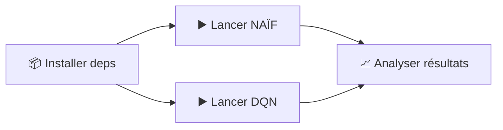

<div align="center">

# 🤖 Expérience DQN Flexible
## Comparaison Naïf vs DQN Complet


</div>

---
Voici un **README.md** complet, rédigé “comme moi”, avec tous les détails pratiques, mes choix imposés (récompenses, protocole de comparaison), et les explications techniques de l’agent.

---

## 🎯 Résumé

<table>
<tr>
<td width="50%">

### 🔬 **Étude de Comparaison**
- 🟦 **NAÏF (Linéaire)** : Pas de replay, pas de réseau cible
- 🟥 **DQN (Complet)** : Replay buffer complet + réseau cible
- ⚖️ **Protocole équitable** : Mêmes épisodes, mêmes récompenses, même seed

</td>
<td width="50%">

### 💾 **Sorties**
- 📁 `figures/flex_<mode>_<lin|mlp>/`
- 📊 Courbes de perte, graphiques de récompense, tableaux de bord
- 🎯 `checkpoints/flex_<mode>/`

</td>
</tr>
</table>

> **💡 Référence Rapide :** Section 4 pour les commandes de lancement | Section 8 décrit toutes les sorties

## 🚀 Résumé Démarrage Rapide



1. **📦 Installer** Python 3.9+ + `numpy`, `matplotlib`, `torch`, `pillow`, `imageio` (section 2)
2. **▶️ Lancer** le mode naïf ou DQN via les commandes de la section 4
3. **📈 Analyser** les figures CSV et checkpoints décrits dans la section 8

---

# README — Expérience flexible (NAÏF ↔ DQN) sur GridWorld
Ce projet me permet de comparer proprement **deux variantes** sur un même code :

* **NAÏF** : pas de replay buffer, pas de target network, une seule tête *online* mise à jour à chaque transition.
* **DQN complet** : replay buffer + mini‐batch + réseau *target* synchronisé périodiquement.

L’environnement est un **GridWorld** (6×6 par défaut) avec **1 goal tiré à chaque épisode** (fixe pendant l’épisode).
Je logge les métriques dans un CSV, j’enregistre des **plots** standardisés (loss, reward, steps, ε & ‖θ‖, etc.), et je sauvegarde des checkpoints.

---

## 1) Arborescence minimale

```
minegym/
├─ envs/
│  └─ gridworld.py                 # GridEnv (fourni)
├─ agents/
│  └─ agentDQN_flexible.py         # Agent unique (paramétrable NAÏF <-> DQN)
├─ utils/
│  ├─ plotting.py                  # Fonctions de tracé (dashboard, courbes…)
│  └─ video.py                     # Outils vidéo (optionnels)
└─ experiments/
   └─ exp_flexible.py              # Script d’expérience (CLI)
```

---

## 2) Installation rapide

Prérequis :

* Python 3.9+
* `numpy`, `matplotlib`, `torch`, `pillow` (et `imageio` si je veux la vidéo)

```bash
pip install numpy matplotlib torch pillow imageio
```

---

## 3) Récompenses (imposées)

Je **fixe** les récompenses suivantes (je ne justifie pas ici) :

```python
reward_step = -3
reward_obstacle_attempt = -10
reward_wall_bump = -5
reward_goal = +35
```

Dans mon code d’expérience, je construis l’env comme ci-dessous :

```python
env = GridEnv(
    rows=6, cols=6, obstacles=None, goals=None, start=None, seed=0, moving_goal=False,
    reward_step=-3, reward_obstacle_attempt=-10, reward_wall_bump=-5, reward_goal=35
)
```

Si besoin, j’adapte ces 4 valeurs au même endroit.

---

## 4) Commandes de lancement (comparaison équitable)

Je garde **le même budget** pour comparer NAÏF vs DQN : même `--episodes`, même `--max-steps`, même `seed`, mêmes récompenses.

### a) NAÏF (linéaire = pas de hidden layer)

```bash
python -m minegym.experiments.exp_flexible \
  --mode naive --hidden "" --episodes 800 --max-steps 120 --seed 0 \
  --lr 0.05 --loss huber --huber-beta 1.0
```

* `--hidden ""` ⇒ **linéaire** (une couche `Linear(n_states→n_actions)`).
* LR plus haut en NAÏF + linéaire (0.05) : c’est ce que j’utilise.

### b) DQN complet (MLP 64-64)

```bash
python -m minegym.experiments.exp_flexible \
  --mode dqn --hidden "64,64" --episodes 800 --max-steps 120 --seed 0 \
  --lr 1e-3 --loss huber --huber-beta 1.0
```

* DQN active **replay** + **target** automatiquement.
* LR typique 1e-3 avec Adam sur un petit MLP.

> Remarque : Matplotlib est en backend **Agg** → pas d’interface live pendant l’entraînement, les figures sont directement sauvegardées.

---

## 5) Paramètres CLI (ceux que je règle le plus)

| Paramètre               |       Défaut | Rôle                                                     |
| ----------------------- | -----------: | -------------------------------------------------------- |
| `--mode`                |      `naive` | `naive` = sans replay/target ; `dqn` = replay+target     |
| `--episodes`            |        `800` | Épisodes d’entraînement                                  |
| `--max-steps`           |        `120` | Pas max par épisode                                      |
| `--seed`                |          `0` | Graine globale                                           |
| `--rows`, `--cols`      |     `6`, `6` | Taille de la grille                                      |
| `--hidden`              |         `""` | `""` → linéaire ; `"64,64"` → MLP                        |
| `--lr`                  |       `1e-3` | Taux d’apprentissage (NAÏF linéaire : je monte à `0.05`) |
| `--gamma`               |       `0.98` | Facteur d’actualisation                                  |
| `--loss`                |        `mse` | `mse` ou `huber`                                         |
| `--huber-beta`          |        `1.0` | Seuil de la Huber                                        |
| `--eps-start/end`       | `1.0 / 0.05` | Epsilon-greedy (départ/min)                              |
| `--eps-decay-steps`     |       `8000` | Décroissance linéaire de ε (steps)                       |
| `--buffer`              |      `50000` | Capacité replay (DQN)                                    |
| `--batch`               |         `64` | Batch size (DQN)                                         |
| `--warmup`              |       `1000` | Min samples avant train (DQN)                            |
| `--train-every`         |          `1` | Fréquence d’update en steps (DQN)                        |
| `--target-update-steps` |       `5000` | Sync du target (steps)                                   |
| `--device`              |        `cpu` | `cpu` ou `cuda`                                          |
| `--save-dir`            |       `None` | Dossier figures/CSV (auto si None)                       |
| `--eval-every`          |         `50` | Évaluations greedy périodiques                           |
| `--eval-episodes`       |         `20` | Nb d’épisodes pour l’éval                                |

**Internes (agent)** : `gradient_clip=10.0`, optimiseur **Adam**, perte **MSE** ou **Huber**.

---

## 6) Ce que fait le code (résumé technique)

### Représentation d’état

* J’encode l’état `s` en **one-hot** de dimension `n_states = rows × cols`.
  Exemple 6×6 → 36 features.

### Réseaux

* **Sortie** : 4 scalaires (Q(s,\cdot)) (← → ↑ ↓).
* **Linéraire** (`--hidden ""`) : `Linear(36 → 4)` sur une 6×6.
  C’est l’équivalent d’une **table Q** paramétrique (144 poids + 4 biais).
* **MLP** (`--hidden "64,64"` par ex.) : `Linear(n_states→64)+ReLU+Linear(64→64)+ReLU+Linear(64→4)`.
  La **dernière couche reste linéaire** (les Q-valeurs ne sont pas bornées).

### Politique / exploration

* **ε-greedy** : aléatoire avec proba ε, sinon `argmax_a Q(s,a)`.
* ε décroît linéairement de `eps_start` à `eps_end` sur `eps_decay_steps` **steps**.

### Cible TD & perte

* **NAÏF** : (Y = r + \gamma \max_{a'} Q_{\text{online}}(s',a')) (ou (r) si `done`).
* **DQN** : (Y = r + \gamma \max_{a'} Q_{\text{target}}(s',a')) (ou (r) si `done`).
* **Perte** : MSE (par défaut) ou **Huber** (`--loss huber --huber-beta 1.0`).
* **Clipping** de gradient L2 à 10.0.

### Replay buffer (DQN)

* Mémoire circulaire `(s,a,r,s',done)` de capacité `--buffer`.
* Entraînement après `--warmup` transitions, puis tous les `--train-every` steps avec des mini-batches `--batch`.

### Target network (DQN)

* Copie du *online*, figée entre deux synchronisations.
* Sync toutes les `--target-update-steps` (en steps).

---

## 7) Comptage de paramètres (affiché au démarrage)

* Linéaire 6×6 → 4 actions : **36×4 + 4 = 148** paramètres.
* Exemple **MLP 64-64** (6×6 → 36 entrées) :

  * 36→64 : `36×64 + 64 = 2368`
  * 64→64 : `64×64 + 64 = 4160`
  * 64→4  : `64×4  + 4  = 260`
  * **Total ≈ 6788** paramètres.

Le script affiche `Paramètres: N` pour le *online* (et le *target* si DQN).

---

## 8) Fichiers générés

Tout est dans `--save-dir` (ou défaut : `figures/flex_<mode>_<lin|mlp>`), et les checkpoints dans `checkpoints/flex_<mode>`.

### Figures

* `V_star_heatmap.png` : heatmap de (V^*(s)=\max_a Q(s,a))
* `pi_star_grid.png` : politique (\pi^*(s)=\arg\max_a Q(s,a))
* `policy_value.png` : V* + π*
* `visits.png` : heatmap des visites d’états
* `dominant_actions.png` : action dominante par case
* `summary_dashboard.png` : dashboard récapitulatif
* `naive_*.png` / `dqn_*.png` : `loss_mean_per_episode`, `steps_per_episode`, `epsilon_theta_over_episodes`, `loss_vs_return`

### CSV & checkpoints

* `<mode>_logs.csv` : `episode, return, length, mean_loss, epsilon, theta_norm`
* `checkpoints/flex_<mode>/best_<mode>.pt` et `final_<mode>.pt`

---

## 9) Protocole de comparaison (ce que je fais)

* **Même seed**, **mêmes épisodes**, **même horizon `--max-steps`**, **mêmes récompenses**.
* NAÏF : `--hidden "" --lr 0.05` ; DQN : `--hidden "64,64" --lr 1e-3`.
* **Même perte** (je prends **Huber** pour les deux) :

  * `--loss huber --huber-beta 1.0`
* Je compare **évolution du return**, **perte moyenne par épisode**, **longueur d’épisode**, **ε**, **‖θ‖**.

---

## 10) Performance & stabilité (mes repères)

* Si j’ai un GPU : `--device cuda`.
* DQN plus rapide si je descends `--batch 32`, `--hidden "32,32"`, ou si j’augmente `--train-every 2`.
* **Huber** + clipping (déjà activé) = très bon compromis au début de l’apprentissage.
* **Backend Agg** : pas d’UI → plus rapide, plots écrits directement.

---

## 11) Dépannage rapide

* **Erreur one_hot / LongTensor** : l’agent encode désormais via une **matrice identité** et cast en `torch.long` ; je n’ai plus ce souci.
* **Import circulaire** : vérifier que `agentDQN_flexible.py` n’importe pas lui-même son propre nom.
* **PowerShell & `--hidden ""`** : si ça casse, je mets `--hidden ""` entre guillemets doubles, ou bien j’écris `--hidden none`.
* **Plots vides** : le dossier `figures/...` doit exister (créé automatiquement avec `ensure_dir`), et `matplotlib.use("Agg")` est bien au tout début.

---

## 12) Notes sur NAÏF “linéaire” (clarification)

Quand j’écris “linéaire (1 neurone)”, je veux dire **“pas de hidden layer”** :

* **36 entrées** (one-hot) → **4 sorties** (une par action).
* C’est l’équivalent d’une **table Q** paramétrique, entraînée par descente de gradient.
* Dernière couche **sans activation** (les Q ne sont pas des probabilités).

---

## 13) Exemples de lancement (récap)

**NAÏF (linéaire) — Huber, LR haut, 800 épisodes :**

```bash
python -m minegym.experiments.exp_flexible \
  --mode naive --hidden "" --episodes 800 --max-steps 120 --seed 0 \
  --lr 0.05 --loss huber --huber-beta 1.0
```

**DQN (64-64) — Huber, 800 épisodes :**

```bash
python -m minegym.experiments.exp_flexible \
  --mode dqn --hidden "64,64" --episodes 800 --max-steps 120 --seed 0 \
  --lr 1e-3 --loss huber --huber-beta 1.0
```

Les récompenses sont **imposées** dans la création de `GridEnv` (voir section 3).
J’analyse ensuite les figures et le CSV dans `figures/flex_<mode>_<lin|mlp>/` et `checkpoints/flex_<mode>/`.

---

Fin du README.
