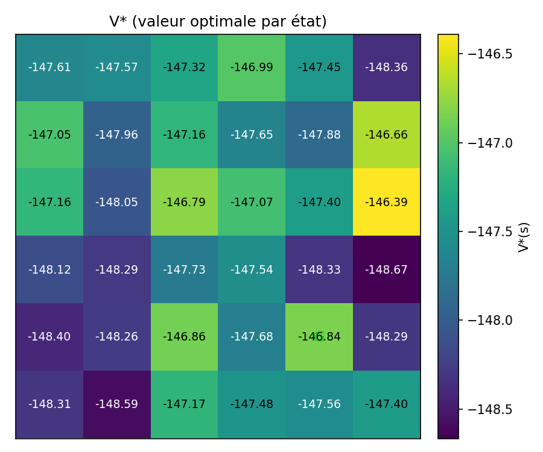
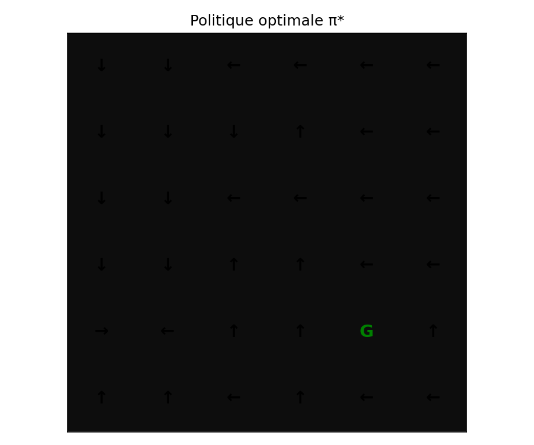
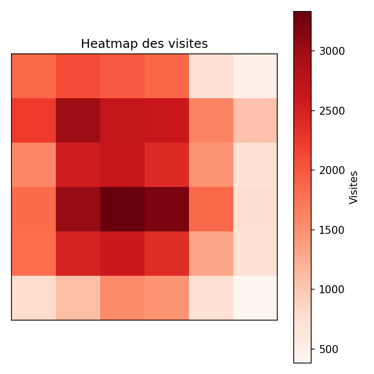
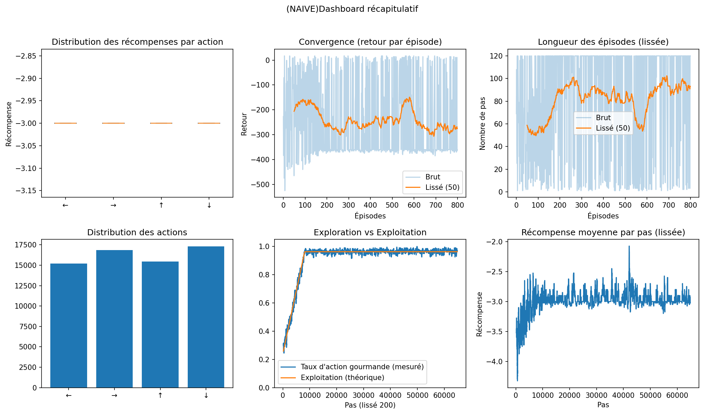

<div align="center">

<!-- Bannière animée -->


<br/>


<br/>


<br/>

<p align="center">
  <a href="README.md">
    
  </a>
  <a href="DQNReadme.md">
    
  </a>
</p>

</div>

<br/>


<br/>

## 🎯 Aperçu

Cette séance poursuit le travail sur le GridWorld paramétrable tout en s'assurant que chaque agent peut toujours gérer la nouvelle définition du monde. L'accent est mis sur la **mise à jour corrigée des valeurs d'action**, les nouvelles **métriques Q-Learning** et la **comparaison DQN vs naïf** décrite dans [`DQNReadme.md`](DQNReadme.md).

## 🚀 Démarrage Rapide

<details open>
<summary><b>⚙️ Configuration de l'Environnement</b></summary>

```powershell
& C:\Users\DJERI\VSCODE\Programmation\python\environnements\rl_venv\Scripts\Activate.ps1
```
</details>

<details open>
<summary><b>📝 Lancer les Diagnostics Q-Learning</b></summary>

```bash
cd Sceance4/minegym
python -m minegym.experiments.liveQL
python -m minegym.experiments.sensitivity_gammaQL
python -m minegym.experiments.sensitivity_grid_sizeQL
```
</details>

<details>
<summary><b>🤖 Lancer les Expériences DQN</b></summary>

Pour l'expérience DQN flexible (`exp_flexible.py`) et la comparaison entre l'agent linéaire naïf et la pile DQN complète, voir la référence CLI complète dans [📖 DQNReadme.md](DQNReadme.md).

</details>

### What changed in this séance?

- The GridWorld now accepts dynamic goals, obstacles, and reward tweaks without touching the scripts.
- All figures (live animation, sensitivity plots, dashboards) still live in `figures/goal`, but the Q-Learning agent’s logging now includes the new `w` correction term.
- We validate that Q-Learning keeps converging before running the DQN comparison.

### Corrected Q-Learning update

We modify the tabular update to include a weighting factor `w`, so the library entry follows:

$$Q(s,a) \leftarrow Q(s,a) + \alpha \cdot w \cdot \left[r + \gamma \max_{a'} Q(s',a') - Q(s,a)\right].$$

The parameter `w` allows us to dampen or accentuate the move toward the TD target when the environment changes from fixed to mobile goals, or when obstacles are reconfigured.

---

## 🖼️ Galerie de Sorties Visuelles

<div align="center">


<br/><br/>

<table>
<tr>
<td align="center" width="33%">
<a href="figures/flex_naive_lin/V_star_heatmap.png">

</a>
<br/><br/>

</td>
<td align="center" width="33%">
<a href="figures/flex_naive_lin/pi_star_grid.png">

</a>
<br/><br/>

</td>
<td align="center" width="33%">
<a href="figures/flex_naive_lin/visits.png">

</a>
<br/><br/>

</td>
</tr>
<tr>
<td align="center" colspan="3">
<br/>
<a href="figures/flex_naive_lin/summary_dashboard.png">

</a>
<br/><br/>

</td>
</tr>
</table>

</div>

---

### 📊 Sorties Visuelles

- Live dashboards: `live_training.mp4`, `summary_dashboard.png`, reward and ε curves (see the `liveQL` description below).
- Heatmap artifacts: `V_star_heatmap_annotated.png`, `pi_star_grid.png`, `policy_value.png`, `visits.png`, `dominant_actions.png`.
- Sensitivity figures: each `sensitivity_gamma*` and `sensitivity_grid*` plot illustrates the convergence dynamics referred to in the table below.

# Modifier l'environnement GridEnv

Le fichier principal pour régler la logique du monde est :`minegym/envs/gridworld.py`
## Définition des actions et états

Les actions sont codées dans `GridEnv` via `action_space = 4` et les mouvements dans `step()` :

```python
# 0: gauche ; 1: droite ; 2: haut ; 3: bas ;c:colonne actuel ; r:ligne actuel ; pc , pr : coordonnees qui devrai etrer obtenu apres l action sans tenir compt des limites du grid
if action == 0: pc = c - 1
elif action == 1: pc = c + 1
elif action == 2: pr = r - 1
elif action == 3: pr = r + 1
# r = state // self.cols   
# c = state %  self.cols 
```
  


Les états sont simplement les entiers `0 … rows*cols-1` (index ligne-colonne aplati).


## Modifier les récompenses (rewards) : 
Dans la classe `GridEnv.__init__` :

```python
self.reward_step = -3 #for waste of time
self.reward_obstacle_attempt = -10 #for obstacle rebump
self.reward_wall_bump = -5 #for limit of grid rebump
self.reward_goal = +35 #for goal
```

## Obstacles (nombre et position)

Dans les fichier de `experiments\` lors de l'instanciation de l env on passe une liste d'indices  representant la position des obstacles ce qui definit leur nombres et leurs position  :
-Nombre d'obstacles : longueur de la liste
-Position : positionner a indice = row*cols + col ( equation provenant de la division euclidienne index par cols où row = index // cols et col = index % cols )

```python
obstacles = [7, 8, 13]
env = GridEnv(rows=6, cols=6, obstacles=obstacles, ...)
```

## Goals statiques (nombre et position)
Toujours lors de l'instanciation du env Dans les fichier de `experiments\` :
- Nombre de goals : taille de la liste
- Position : même logique que les obstacles (row*cols+col)

et il faut aussi garder 
```python
goals = [35]                 # un seul goal
goals = [35, 18, 5]          # plusieurs goals
env = GridEnv(..., goals=goals, ...)
```

## Goals dynamiques (bouger le goal à chaque step)

Toujours lors de l'instanciation du env Dans les fichier de `experiments\` :
- Nombre de goals : taille de la liste
- Position de depart : même logique que les obstacles (row*cols+col) 

et il faut aussi garder 
```python
goals = [35]                 # un seul goal
goals = [35, 18, 5]          # plusieurs goals
env = GridEnv(..., goals=goals, ... , moving_goal=True,moving_mode="random") # ou moving_mode="cyclic" ou redefinir une autre methode dans un nouvelle valeur de moving_mode  dans _move_goals dans la classe GridEnv
```

#  graphiques générés dans `figures/`

## `experiments/liveQL.py`

**Pendant l'exécution** :  Le flux animé  contient : 

- **gauche** : grille du monde (blanc=libre, noir=obstacle, vert=goal, rouge=agent)
- **Haut droite** : cumul du reward au fur et à mesure du step courant
- **Bas droite** : reward total par épisode (avec moyenne mobile sur 10 épisodes)

on genere aussi :

## Pendant l’exécution (fenêtre live)

- **Gauche** : grille (blanc=libre, noir=obstacle, vert=goal, rouge=agent, quadrillage visible).
- **Haut-droite** : cumul du reward du step courant.
- **Bas-droite** : reward par épisode + moyenne mobile(10).

- **live_training.mp4** — animation du live (H.264, frame-skip & downscale pour économiser RAM).
- **V_star_heatmap_annotated.png** — heatmap annotée de V* (= max_a Q(s,a)).
- **pi_star_grid.png** — politique greedy (flèches argmax_a Q(s,a)).
- **policy_value.png** — récap valeur/politique.
- **visits.png** — heatmap des visites d’états.
- **dominant_actions.png** — action dominante observée par état.
- **summary_dashboard.png** — dashboard récapitulatif (voir calculs).
- **live_explore_exploit_empirical.png** — Exploration/Exploitation : empirique vs théorique.


## `experiments/sensitivity_gamma.py`

- `sensitivity_gamma_convergence_ci.png` : **convergence** (reward moyen par épisode, **MA=50**), une courbe par γ (moyenne inter-seeds, IC95% optionnelle).
- `sensitivity_gamma_time_to_threshold.png` : **temps pour atteindre un seuil** de performance (MA=50 ≥ **-10**) — **plus bas = plus rapide**.
- `sensitivity_gamma_final.png` : **performance finale** (moyenne des **200** derniers épisodes) avec barres d’erreur (écart-type inter-seeds).
- `sensitivity_gamma_episode_length.png` : **longueur des épisodes** (lissé MA=50) vs épisodes pour **un seed fixe** (illustratif).
- `sensitivity_gamma_explore_exploit.png` : **profil exploration/exploitation théorique** (planification d’ε via `eps_schedule`).
- `sensitivity_gamma_prop_greedy_subplots.png` : **profil exploration/exploitation empirique** (**proportion d’actions greedy** mesurée pendant l’apprentissage), 11 sous-figures (une par γ).


## `experiments/sensitivity_grid_size.py`

- `sensitivity_grid_convergence.png` : **convergence** (reward moyen par épisode, **MA=50**), une courbe par **taille** de grille (4×4 → 10×10).
- `sensitivity_grid_final.png` : **performance finale** (moyenne des **200** derniers épisodes) par **taille**, avec barres d’erreur (écart-type intra-run).
- `sensitivity_grid_episode_length.png` : **longueur des épisodes** (lissée MA=50) vs épisodes, une courbe par **taille**.
- `sensitivity_grid_explore_exploit.png` : **profil exploration/exploitation théorique** (planification d’ε commune à toutes les tailles).
- `sensitivity_grid_prop_greedy_subplots.png` : **exploration/exploitation empirique** — 7 sous-figures (**proportion d’actions greedy** mesurée pendant l’apprentissage), une par **taille**.


# Note

- Toutes les valeurs (récompenses, obstacles, goals, start ) doivent être modifiées dans les **scripts experiments/**  via en fonction de ce que on veut tester ou observer (goal mobile/fixe ; position des obstacles ,.....  ): 
```python
class GridEnv(
    rows: int = 4,
    cols: int = 4,
    obstacles: List[int] | None = None,
    goals: int | List[int] | None = None,
    start: int | None = None,
    seed: int = 0,
    reward_step: int = -3,
    reward_obstacle_attempt: int = -10,
    reward_wall_bump: int = -5,
    reward_goal: int = +20,
    moving_goal: bool = False,
    moving_mode: str = "random"
)
```

- sauf si tu veux changer définitivement la logique → alors modifie `gridworld.py`.


