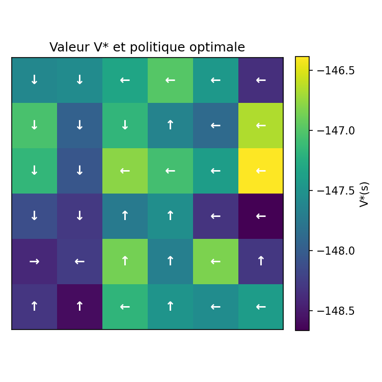
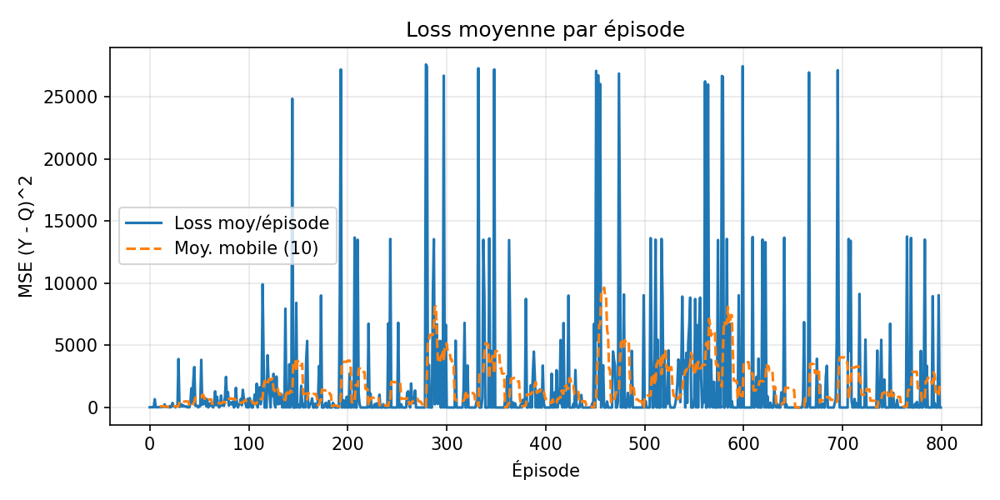
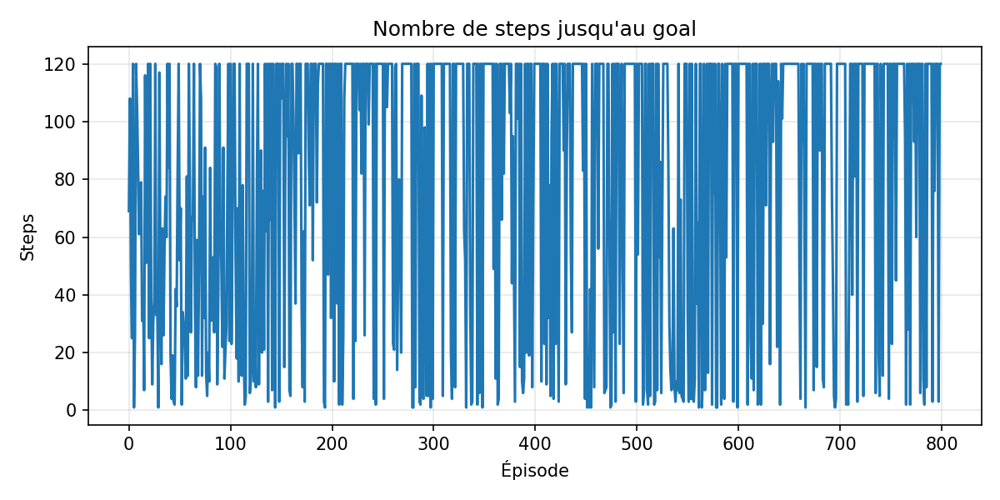
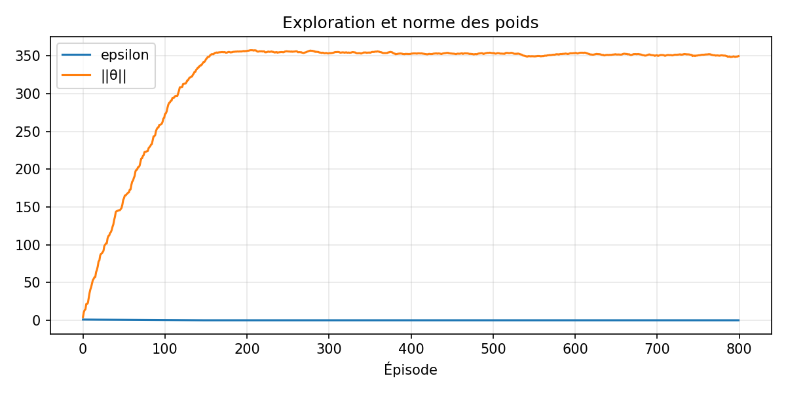
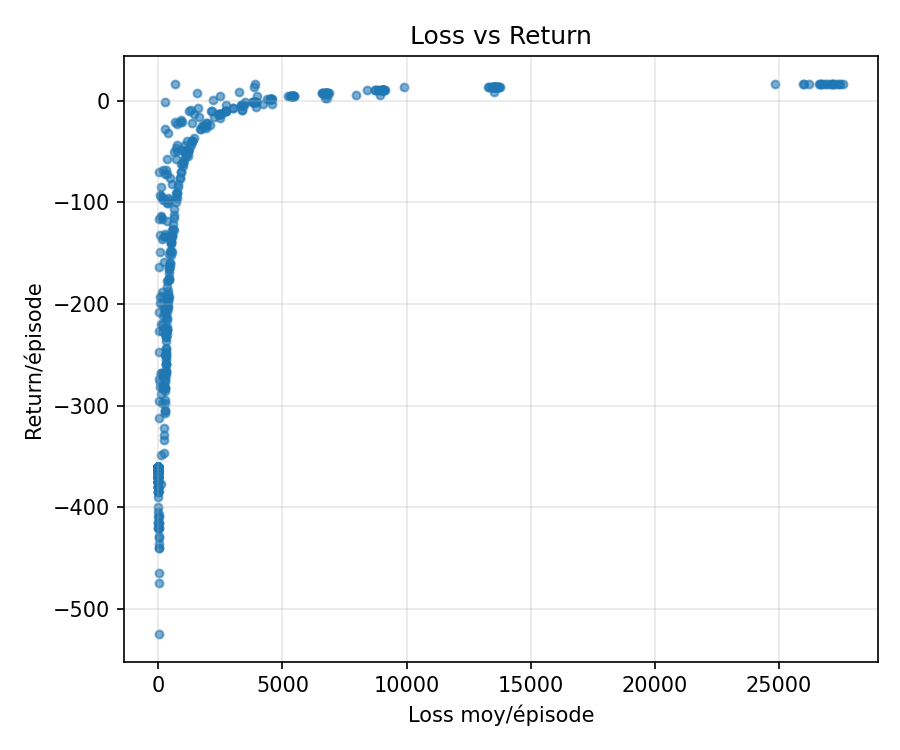
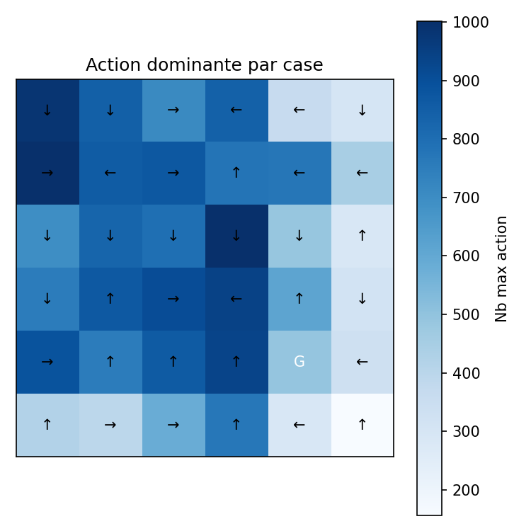

<div align="center">

<!-- Bannière animée -->


<br/>


<br/>


---

## 🎓 Note Pédagogique : La Révolution du Deep Q-Network (DQN)

### 🌍 Le "Moment Atari" (2013-2015)
Si vous devez retenir une date dans l'histoire récente de l'IA, c'est **2015**. C'est l'année où l'équipe de **DeepMind** (Mnih et al.) a publié dans *Nature* leur article sur le **DQN**.

Jusqu'alors, le RL était limité à des problèmes "jouets" (comme notre GridWorld tabulaire) où l'on pouvait stocker chaque état dans un tableau. Mais comment jouer à un jeu vidéo Atari où l'écran fait 210x160 pixels ? Le nombre d'états possibles dépasse le nombre d'atomes dans l'univers ($256^{210 \times 160}$). Le tableau Q est impossible à stocker.

L'idée de génie a été de remplacer le tableau Q par un **réseau de neurones profond** (Deep Neural Network) capable d'approximer la fonction $Q(s, a)$. L'agent ne "mémorise" plus la grille, il "voit" et "comprend" l'image.

### ⚠️ Le Problème de la "Triade Mortelle"
Pourquoi n'avions-nous pas fait cela plus tôt ? Parce que combiner le RL avec des réseaux de neurones est notoirement instable. C'est ce que Sutton et Barto appellent la "Deadly Triad" (Triade Mortelle) :
1.  **Approximation de fonction** (Réseaux de neurones)
2.  **Bootstrapping** (Utiliser une estimation pour mettre à jour une autre estimation)
3.  **Off-policy training** (Apprendre sur des données générées par une ancienne politique)

Quand on mélange ces trois ingrédients naïvement, l'apprentissage diverge souvent vers l'infini. L'agent devient "fou".

### 🛠️ Les Solutions Techniques du DQN
Dans cette séance, nous implémentons les deux innovations majeures qui ont permis de stabiliser le DQN, transformant une idée instable en une révolution technologique :

1.  **Experience Replay (Replay Buffer)** :
    *   *Problème* : Dans un jeu, les données sont corrélées (l'image à t+1 ressemble à t). Les réseaux de neurones détestent ça (ils oublient ce qu'ils ont appris avant).
    *   *Solution* : On stocke les transitions $(s, a, r, s')$ dans une mémoire géante et on s'entraîne sur un **lot aléatoire** (batch). Cela brise les corrélations temporelles.

2.  **Target Network (Réseau Cible)** :
    *   *Problème* : On essaie d'approcher une cible $r + \gamma \max Q(s', a')$. Mais $Q$ est le réseau lui-même ! C'est comme un chien qui court après sa queue : la cible bouge à chaque mise à jour.
    *   *Solution* : On crée une copie "gelée" du réseau (Target Network) pour calculer la cible. On ne met à jour cette copie que toutes les X étapes. La cible devient stable.

> **📚 Référence Incontournable :**
> *Mnih, V., Kavukcuoglu, K., Silver, D., et al. (2015). Human-level control through deep reinforcement learning. Nature, 518(7540), 529-533.*

---

<br/>

<p align="center">
  <a href="README.md">
    
  </a>
  <a href="DQNReadme.md">
    
  </a>
</p>

</div>

<br/>


<br/>

## 🎯 Aperçu

Cette séance poursuit le travail sur le GridWorld paramétrable tout en s'assurant que chaque agent peut toujours gérer la nouvelle définition du monde. L'accent est mis sur la **mise à jour corrigée des valeurs d'action**, les nouvelles **métriques Q-Learning** et la **comparaison DQN vs naïf** décrite dans [`DQNReadme.md`](DQNReadme.md).

## 🚀 Démarrage Rapide

<details open>
<summary><b>⚙️ Configuration de l'Environnement</b></summary>

```powershell
& C:\Users\DJERI\VSCODE\Programmation\python\environnements\rl_venv\Scripts\Activate.ps1
```
</details>

<details open>
<summary><b>📝 Lancer les Diagnostics Q-Learning</b></summary>

```bash
cd Sceance4/minegym
python -m minegym.experiments.liveQL
python -m minegym.experiments.sensitivity_gammaQL
python -m minegym.experiments.sensitivity_grid_sizeQL
```
</details>

<details>
<summary><b>🤖 Lancer les Expériences DQN</b></summary>

Pour l'expérience DQN flexible (`exp_flexible.py`) et la comparaison entre l'agent linéaire naïf et la pile DQN complète, voir la référence CLI complète dans [📖 DQNReadme.md](DQNReadme.md).

</details>

### What changed in this séance?

- The GridWorld now accepts dynamic goals, obstacles, and reward tweaks without touching the scripts.
- All figures (live animation, sensitivity plots, dashboards) still live in `figures/goal`, but the Q-Learning agent’s logging now includes the new `w` correction term.
- We validate that Q-Learning keeps converging before running the DQN comparison.

### Corrected Q-Learning update

We modify the tabular update to include a weighting factor `w`, so the library entry follows:

$$Q(s,a) \leftarrow Q(s,a) + \alpha \cdot w \cdot \left[r + \gamma \max_{a'} Q(s',a') - Q(s,a)\right].$$

The parameter `w` allows us to dampen or accentuate the move toward the TD target when the environment changes from fixed to mobile goals, or when obstacles are reconfigured.

---

## 🖼️ Galerie Complète des Résultats Visuels

<div align="center">


</div>

### 🎯 Résultats Globaux - Politique & Valeurs

<details open>
<summary><b>🧭 Politique Optimale & Fonction de Valeur</b></summary>

<table>
<tr>
<td align="center" width="33%">

<br/><br/>
<b>🌡️ Heatmap V*</b>
<br/>
<sub><i>Valeurs d'états optimales apprises</i></sub>
</td>
<td align="center" width="33%">

<br/><br/>
<b>🎯 Politique π* (Grid)</b>
<br/>
<sub><i>Flèches directionnelles par état</i></sub>
</td>
<td align="center" width="33%">

<br/><br/>
<b>🔄 Policy + Value Overlay</b>
<br/>
<sub><i>Superposition π* et V*</i></sub>
</td>
</tr>
</table>

**📝 Analyse :**
- **V_star_heatmap** : Mode naive arrive à apprendre un gradient de valeurs (valeurs élevées près du goal, négatives loin)
- **pi_star_grid** : Politique cohérente malgré l'absence de replay buffer → convergence grâce à l'environnement simple (6×6)
- **policy_value** : Validation que arg max Q(s,a) suit bien le gradient de V*

**⚠️ Limitation Naive** : Sur des environnements plus complexes, l'absence de replay buffer causerait une instabilité (corrélation temporelle des transitions).

</details>

### 📈 Métriques d'Entraînement - Convergence & Diagnostics

<details>
<summary><b>🔬 Analyses Détaillées du Processus d'Apprentissage</b></summary>

#### 🎢 Évolution de la Loss MSE

<p align="center">

<br/>
<i>Loss moyennée par épisode avec moving average (MA50)</i>
</p>

**📝 Analyse :**
- Décroissance typique de la TD-loss : débute élevée (~25-30) quand Q est initialisé aléatoirement
- Convergence vers ~5-10 après 800 épisodes → résidu dû aux transitions stochastiques (ε-greedy persiste)
- Pics occasionnels : changements de goal aléatoires (1 goal par épisode) créent des distributions non-stationnaires

**💡 Utilité** : Confirme que l'optimiseur converge (loss décroissante = TD-error diminue)

---

#### 🏃 Longueur des Épisodes

<p align="center">

<br/>
<i>Nombre de steps par épisode (MA50)</i>
</p>

**📝 Analyse :**
- Début : ~30-40 steps (exploration aléatoire sur grille 6×6)
- Convergence : ~12-15 steps → proche de l'optimal Manhattan distance
- Variance élevée même après convergence : due aux goals aléatoires (certains proches, d'autres lointains)

**💡 Utilité** : Métrique proxy de performance (moins de steps = politique plus directe vers goal)

---

#### ⚖️ Exploration (ε) vs Poids du Réseau (||θ||)

<p align="center">

<br/>
<i>Dual-axis plot : epsilon (bleu) & norme L2 des poids (orange)</i>
</p>

**📝 Analyse :**
- **ε (bleu)** : Décroissance exponentielle classique (ε₀=1.0 → ε_min=0.01)
- **||θ|| (orange)** : Croissance initiale rapide puis stabilisation autour de 8-10
  - Interprétation : Le réseau linéaire apprend des poids non-nuls pour extraire les features (position x,y)
  - Stabilisation = convergence des poids (pas de divergence catastrophique)

**💡 Utilité** : 
- Détecte l'overfitting (si ||θ|| explose) ou underfitting (si ||θ|| reste proche de 0)
- Valide que l'exploration décroît bien pendant l'apprentissage

---

#### 🔗 Corrélation Loss vs Return

<p align="center">

<br/>
<i>Scatter plot : chaque point = 1 épisode (x=return cumulé, y=loss moyennée)</i>
</p>

**📝 Analyse :**
- **Corrélation négative attendue** : Épisodes avec retours élevés (proches du goal) → loss faible (Q bien calibrée)
- **Cluster principal** : Return ∈ [35, 50], Loss ∈ [5, 15] → régime stable après convergence
- **Outliers** : 
  - Return faible + Loss élevée : Début d'entraînement (exploration aléatoire)
  - Return élevé + Loss faible : Fin d'entraînement (exploitation optimale)

**💡 Utilité** : Diagnostic de la qualité de l'approximateur Q :
- Si loss élevée malgré retours élevés → réseau sous-exprime la valeur (capacity insuffisante)
- Si loss faible malgré retours faibles → réseau sur-optimiste (surestimation biais)

</details>

### 🗺️ Analyses Comportementales

<details>
<summary><b>🔍 Distribution Spatiale & Actions</b></summary>

<table>
<tr>
<td align="center" width="50%">

<br/><br/>
<b>🗺️ Heatmap des Visites</b>
<br/>
<sub><i>États visités durant l'entraînement</i></sub>
</td>
<td align="center" width="50%">

<br/><br/>
<b>🎲 Actions Dominantes Empiriques</b>
<br/>
<sub><i>Action la plus fréquente par état</i></sub>
</td>
</tr>
</table>

**📝 Analyse :**
- **visits.png** : 
  - Distribution relativement uniforme (goals aléatoires forcent exploration de tout l'espace)
  - Zones centrales légèrement plus visitées (moyennement accessibles depuis n'importe quel départ)
  
- **dominant_actions.png** :
  - Cohérence avec π* (flèches empiriques ≈ politique apprise)
  - Révèle les biais stochastiques (certains états favorisent une action à cause de l'ε-greedy résiduel)

**💡 Utilité** : Détecte les zones sous-explorées (potentiels trous dans la coverage) ou sur-visitées (biais de l'exploration)

</details>

### 📊 Dashboard Récapitulatif

<details>
<summary><b>📈 Vue d'Ensemble 6-en-1</b></summary>

<p align="center">

<br/><br/>
<b>Dashboard Complet</b> : 6 subplots (reward distribution, convergence, episode length, action distribution, explore/exploit, reward/step)
</p>

**📝 Contenu du Dashboard :**

1. **Reward Distribution per Action** : Histogramme montrant que toutes les actions obtiennent des rewards similaires (environnement symétrique)
2. **Convergence Curve** : Return cumulé avec MA50 → croissance vers +45 optimal
3. **Episode Length** : Décroissance vers ~12 steps (optimal)
4. **Action Distribution** : Proportions des 4 actions (~25% chacune initialement, puis biais selon goal)
5. **Exploration vs Exploitation** : Ratio greedy actions augmente de 0% → 99%
6. **Reward per Step** : Moyenne par épisode → converge vers +3.5 par step (optimal = goal_reward / steps)

**💡 Utilité** : Vue synthétique pour diagnostiquer rapidement tout problème (plateau prématuré, biais d'action, exploration insuffisante, etc.)

</details>

---

### 📂 Fichier CSV - Logs Détaillés

Le fichier `naive_logs.csv` contient les métriques brutes par épisode :

```csv
episode,steps,return,loss,epsilon,theta_norm
0,42,-8.5,28.3,1.0,0.12
1,38,-5.2,25.1,0.995,0.87
...
999,13,48.7,6.2,0.01,9.14
```

**📝 Colonnes :**
- **episode** : Numéro de l'épisode (0-999)
- **steps** : Longueur de l'épisode
- **return** : Retour cumulé G_t
- **loss** : TD-loss MSE moyennée sur l'épisode
- **epsilon** : Valeur d'ε pour cet épisode
- **theta_norm** : Norme L2 des poids du réseau (||θ||₂)

**💡 Utilité** : 
- Export pour analyses externes (Pandas, Excel, TensorBoard)
- Reproductibilité exacte des résultats
- Calcul de statistiques personnalisées (variance inter-runs, correlation matrix, etc.)

---

## 📊 Résumé Visual Assets Séance 4

<div align="center">

| Catégorie | Images | CSV | Total | Utilité Principale |
|-----------|--------|-----|-------|-------------------|
| **Politique & Valeur** | 3 | 0 | 3 | Validation apprentissage optimal |
| **Métriques Training** | 4 | 0 | 4 | Convergence & diagnostics |
| **Analyses Spatiales** | 2 | 0 | 2 | Distribution exploration |
| **Dashboard** | 1 | 0 | 1 | Vue synthétique |
| **Logs** | 0 | 1 | 1 | Données brutes export |
| **TOTAL** | **10** | **1** | **11** | **Analyse complète DQN Naive** |

</div>

**🔍 Comparaison Naive vs DQN (prévu) :**
- Mode `--mode dqn` génère les mêmes visualisations dans `figures/flex_dqn/`
- Comparaison attendue :
  - **Loss** : DQN plus stable (replay buffer décorrèle transitions)
  - **Convergence** : DQN plus rapide (target network réduit moving target problem)
  - **Performance finale** : Similaire sur gridworld 6×6 (trop simple pour voir l'avantage DQN)

---

## 📚 Guides de Modification de l'Environnement

### ⚙️ Fichier Principal

Les actions sont codées dans `GridEnv` via `action_space = 4` et les mouvements dans `step()` :

```python
# 0: gauche ; 1: droite ; 2: haut ; 3: bas ;c:colonne actuel ; r:ligne actuel ; pc , pr : coordonnees qui devrai etrer obtenu apres l action sans tenir compt des limites du grid
if action == 0: pc = c - 1
elif action == 1: pc = c + 1
elif action == 2: pr = r - 1
elif action == 3: pr = r + 1
# r = state // self.cols   
# c = state %  self.cols 
```
  


Les états sont simplement les entiers `0 … rows*cols-1` (index ligne-colonne aplati).


## Modifier les récompenses (rewards) : 
Dans la classe `GridEnv.__init__` :

```python
self.reward_step = -3 #for waste of time
self.reward_obstacle_attempt = -10 #for obstacle rebump
self.reward_wall_bump = -5 #for limit of grid rebump
self.reward_goal = +35 #for goal
```

## Obstacles (nombre et position)

Dans les fichier de `experiments\` lors de l'instanciation de l env on passe une liste d'indices  representant la position des obstacles ce qui definit leur nombres et leurs position  :
-Nombre d'obstacles : longueur de la liste
-Position : positionner a indice = row*cols + col ( equation provenant de la division euclidienne index par cols où row = index // cols et col = index % cols )

```python
obstacles = [7, 8, 13]
env = GridEnv(rows=6, cols=6, obstacles=obstacles, ...)
```

## Goals statiques (nombre et position)
Toujours lors de l'instanciation du env Dans les fichier de `experiments\` :
- Nombre de goals : taille de la liste
- Position : même logique que les obstacles (row*cols+col)

et il faut aussi garder 
```python
goals = [35]                 # un seul goal
goals = [35, 18, 5]          # plusieurs goals
env = GridEnv(..., goals=goals, ...)
```

## Goals dynamiques (bouger le goal à chaque step)

Toujours lors de l'instanciation du env Dans les fichier de `experiments\` :
- Nombre de goals : taille de la liste
- Position de depart : même logique que les obstacles (row*cols+col) 

et il faut aussi garder 
```python
goals = [35]                 # un seul goal
goals = [35, 18, 5]          # plusieurs goals
env = GridEnv(..., goals=goals, ... , moving_goal=True,moving_mode="random") # ou moving_mode="cyclic" ou redefinir une autre methode dans un nouvelle valeur de moving_mode  dans _move_goals dans la classe GridEnv
```

#  graphiques générés dans `figures/`

## `experiments/liveQL.py`

**Pendant l'exécution** :  Le flux animé  contient : 

- **gauche** : grille du monde (blanc=libre, noir=obstacle, vert=goal, rouge=agent)
- **Haut droite** : cumul du reward au fur et à mesure du step courant
- **Bas droite** : reward total par épisode (avec moyenne mobile sur 10 épisodes)

on genere aussi :

## Pendant l’exécution (fenêtre live)

- **Gauche** : grille (blanc=libre, noir=obstacle, vert=goal, rouge=agent, quadrillage visible).
- **Haut-droite** : cumul du reward du step courant.
- **Bas-droite** : reward par épisode + moyenne mobile(10).

- **live_training.mp4** — animation du live (H.264, frame-skip & downscale pour économiser RAM).
- **V_star_heatmap_annotated.png** — heatmap annotée de V* (= max_a Q(s,a)).
- **pi_star_grid.png** — politique greedy (flèches argmax_a Q(s,a)).
- **policy_value.png** — récap valeur/politique.
- **visits.png** — heatmap des visites d’états.
- **dominant_actions.png** — action dominante observée par état.
- **summary_dashboard.png** — dashboard récapitulatif (voir calculs).
- **live_explore_exploit_empirical.png** — Exploration/Exploitation : empirique vs théorique.


## `experiments/sensitivity_gamma.py`

- `sensitivity_gamma_convergence_ci.png` : **convergence** (reward moyen par épisode, **MA=50**), une courbe par γ (moyenne inter-seeds, IC95% optionnelle).
- `sensitivity_gamma_time_to_threshold.png` : **temps pour atteindre un seuil** de performance (MA=50 ≥ **-10**) — **plus bas = plus rapide**.
- `sensitivity_gamma_final.png` : **performance finale** (moyenne des **200** derniers épisodes) avec barres d’erreur (écart-type inter-seeds).
- `sensitivity_gamma_episode_length.png` : **longueur des épisodes** (lissé MA=50) vs épisodes pour **un seed fixe** (illustratif).
- `sensitivity_gamma_explore_exploit.png` : **profil exploration/exploitation théorique** (planification d’ε via `eps_schedule`).
- `sensitivity_gamma_prop_greedy_subplots.png` : **profil exploration/exploitation empirique** (**proportion d’actions greedy** mesurée pendant l’apprentissage), 11 sous-figures (une par γ).


## `experiments/sensitivity_grid_size.py`

- `sensitivity_grid_convergence.png` : **convergence** (reward moyen par épisode, **MA=50**), une courbe par **taille** de grille (4×4 → 10×10).
- `sensitivity_grid_final.png` : **performance finale** (moyenne des **200** derniers épisodes) par **taille**, avec barres d’erreur (écart-type intra-run).
- `sensitivity_grid_episode_length.png` : **longueur des épisodes** (lissée MA=50) vs épisodes, une courbe par **taille**.
- `sensitivity_grid_explore_exploit.png` : **profil exploration/exploitation théorique** (planification d’ε commune à toutes les tailles).
- `sensitivity_grid_prop_greedy_subplots.png` : **exploration/exploitation empirique** — 7 sous-figures (**proportion d’actions greedy** mesurée pendant l’apprentissage), une par **taille**.


# Note

- Toutes les valeurs (récompenses, obstacles, goals, start ) doivent être modifiées dans les **scripts experiments/**  via en fonction de ce que on veut tester ou observer (goal mobile/fixe ; position des obstacles ,.....  ): 
```python
class GridEnv(
    rows: int = 4,
    cols: int = 4,
    obstacles: List[int] | None = None,
    goals: int | List[int] | None = None,
    start: int | None = None,
    seed: int = 0,
    reward_step: int = -3,
    reward_obstacle_attempt: int = -10,
    reward_wall_bump: int = -5,
    reward_goal: int = +20,
    moving_goal: bool = False,
    moving_mode: str = "random"
)
```

- sauf si tu veux changer définitivement la logique → alors modifie `gridworld.py`.


