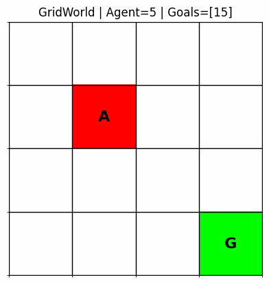
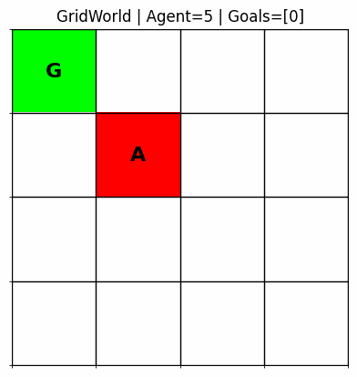
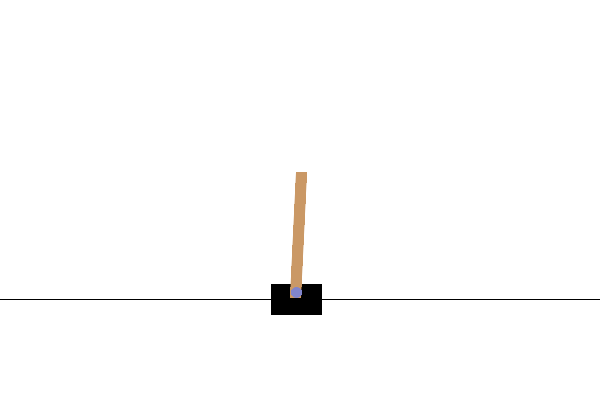
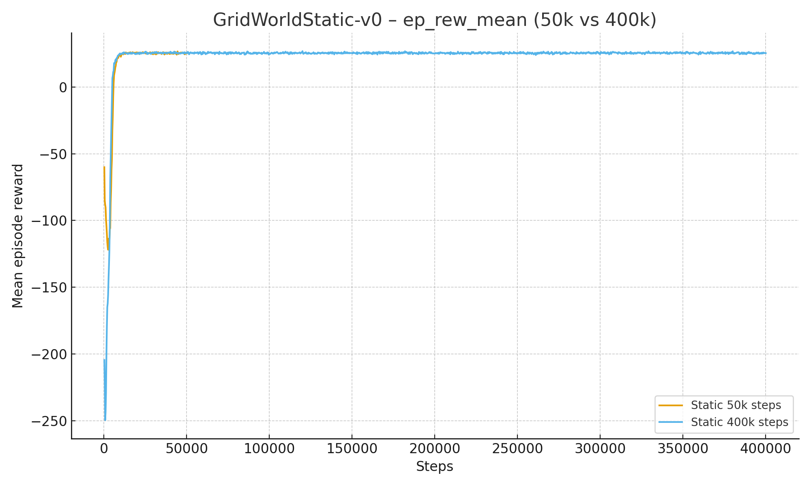
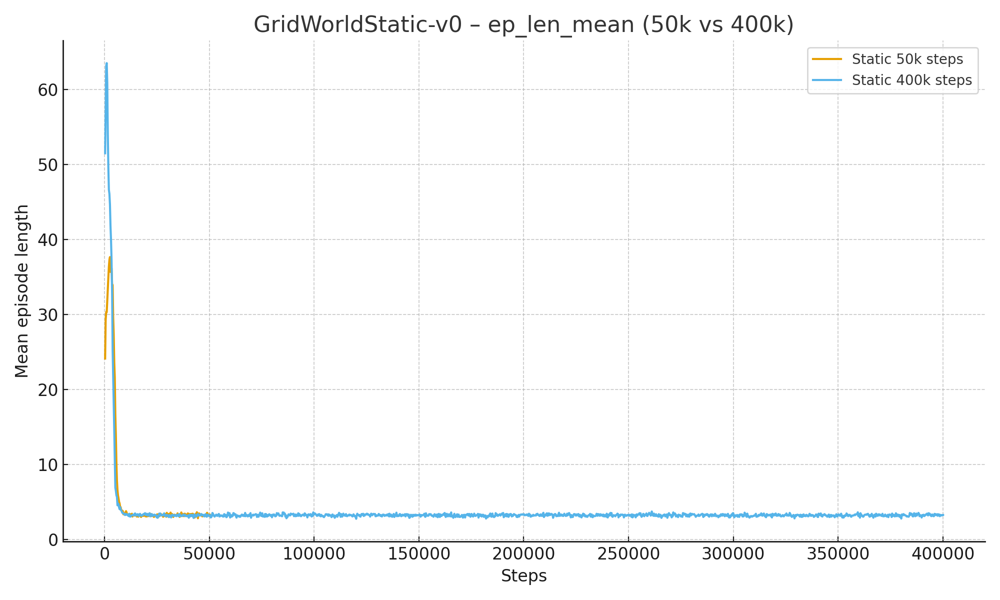
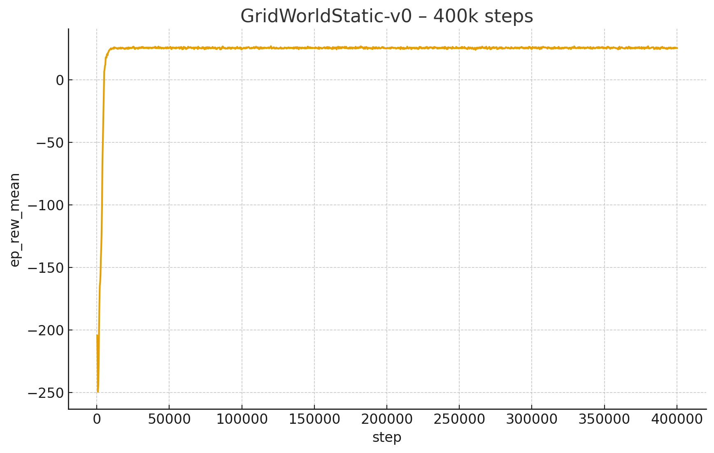
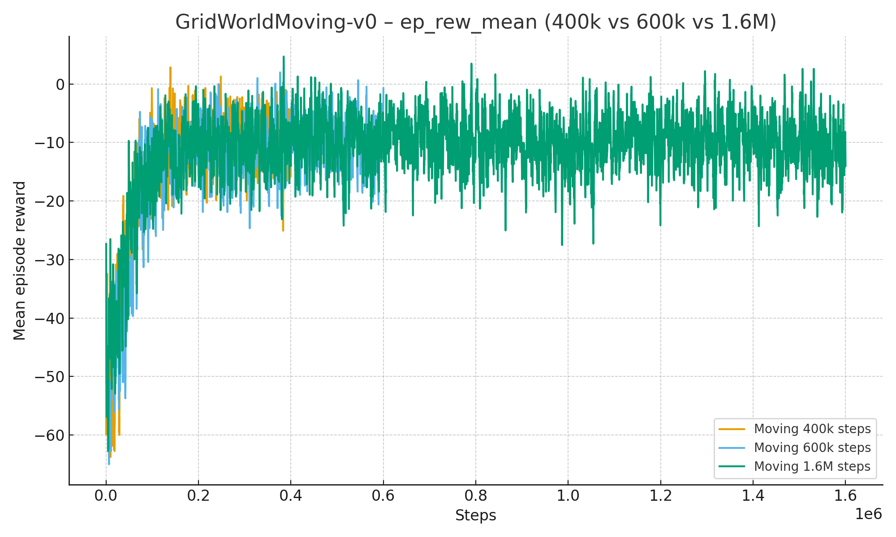
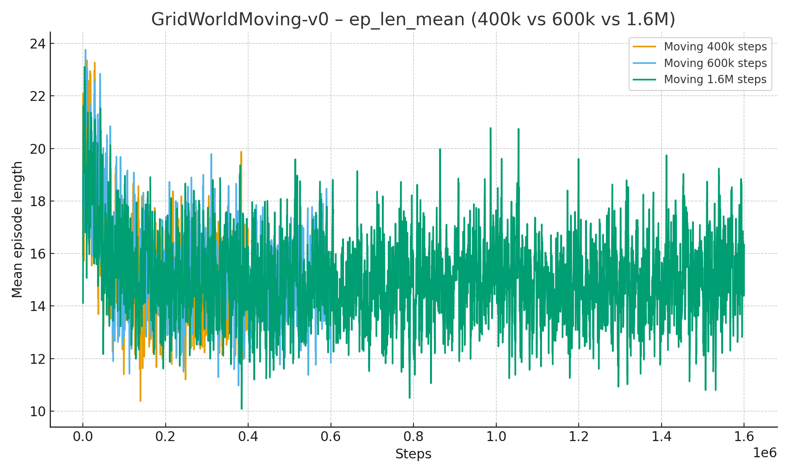
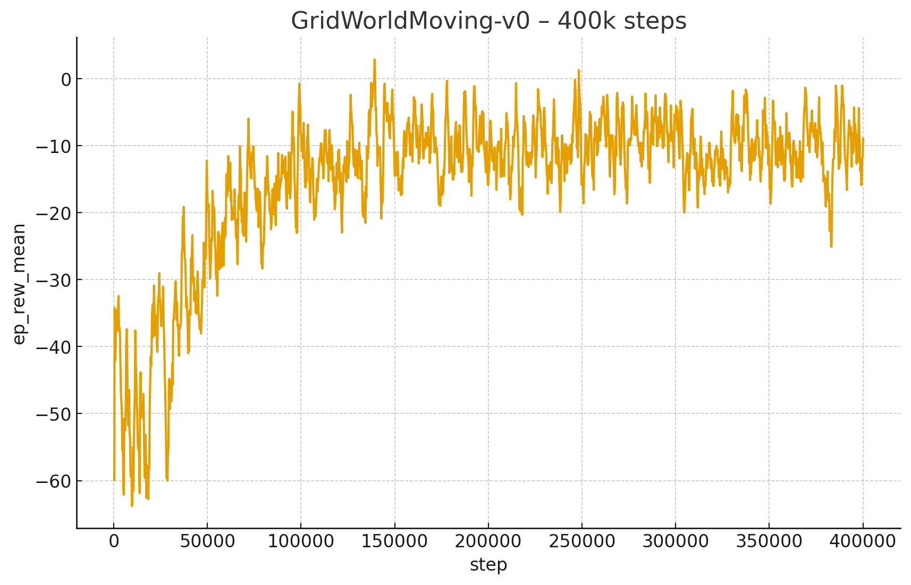
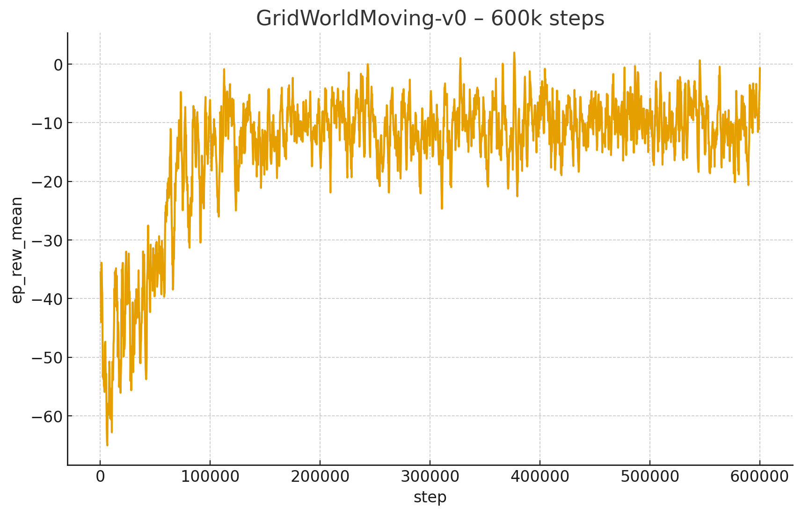

<div align="center">


<br/>


<br/>

**Mini-étude PPO sur GridWorld statique/mobile et CartPole avec analyse de convergence**

</div>

<br/>


---

## 🎓 Note Pédagogique : PPO et l'Ère Moderne du RL

### 🚀 Pourquoi PPO a tout changé (2017)
Si DQN (2015) a prouvé que le Deep RL était possible, **PPO (Proximal Policy Optimization)**, publié par **OpenAI** (Schulman et al., 2017), a prouvé qu'il pouvait être *fiable* et *utilisable*.

Avant PPO, nous utilisions des méthodes comme TRPO (Trust Region Policy Optimization) qui étaient mathématiquement élégantes mais extrêmement complexes à implémenter et lourdes à calculer. PPO a apporté une simplicité déconcertante avec une efficacité redoutable. C'est aujourd'hui l'algorithme "par défaut" utilisé par OpenAI (notamment pour entraîner ChatGPT via RLHF) et la plupart des chercheurs.

### 🧠 Policy Gradient vs Q-Learning
Dans les séances précédentes (DQN), nous utilisions des méthodes basées sur la **valeur** (Value-Based) : on apprend $Q(s,a)$ pour déduire la politique $\pi(s) = \arg\max Q$.
Ici, avec PPO, nous sommes dans la famille des **Policy Gradients** : on apprend *directement* la politique $\pi_\theta(a|s)$ (la probabilité de prendre une action).

*   **Avantage** : Peut gérer des espaces d'actions continus (comme contrôler un bras robotique) et des politiques stochastiques.
*   **Inconvénient** : Très sensible au "step size". Si on modifie trop brutalement la politique, l'agent "tombe de la falaise" et ne s'en remet jamais.

### 🛡️ Le Génie du "Clipping"
L'innovation majeure de PPO réside dans sa fonction objective "clippée".
Imaginez un professeur qui corrige un élève.
*   Si l'élève s'améliore un peu, le professeur l'encourage.
*   Si l'élève veut changer radicalement sa méthode de travail d'un coup, le professeur dit "Stop ! Pas trop vite".

Mathématiquement, PPO limite (clip) le ratio entre la nouvelle et l'ancienne politique :
$$ r_t(\theta) = \frac{\pi_{\theta}(a_t|s_t)}{\pi_{\theta_{old}}(a_t|s_t)} $$
On force ce ratio à rester dans un intervalle $[1-\epsilon, 1+\epsilon]$ (généralement $\epsilon=0.2$). Cela garantit des mises à jour **monotones** et **sûres**. C'est ce qui rend PPO si robuste aux hyperparamètres comparé à ses prédécesseurs.

> **📚 Référence Incontournable :**
> *Schulman, J., Wolski, F., Dhariwal, P., Radford, A., & Klimov, O. (2017). Proximal policy optimization algorithms. arXiv preprint arXiv:1707.06347.*

---

## 🎯 Aperçu

Ce dépôt présente une mini-étude expérimentale autour de PPO appliqué à :

1. **GridWorld statique** (`GridWorldStatic-v0`) - goal fixe
2. **GridWorld mobile** (`GridWorldMoving-v0`) - goal qui se déplace
3. **Transfert** - finetuning du Moving à partir d'un agent Static pré-entraîné
4. **CartPole-v1** - environnement de référence

**Technologies** : Stable-Baselines3, rl-baselines3-zoo, environnement GridWorld custom inspiré de [seance2/minegym](../seance2/minegym)

**Analyse** : TensorBoard (convergence récompenses, longueurs épisodes, pertes) et GIFs de visualisation qualitative

## 🚀 Démarrage Rapide

<details open>
<summary><b>⚙️ 1. Structure du Projet</b></summary>

```
Seance5/rl_sb/
├── gridworld_env/          # Package environnement GridWorld
├── gridworld_runs/         # GIFs et vidéos des agents
├── models/ppo/             # Checkpoints des modèles
└── rl-baselines3-zoo/      # Framework d'entraînement
    └── logs/               # TensorBoard logs
```
</details>

<details>
<summary><b>📦 2. Installation de l'Environnement</b></summary>

```bash
cd Seance5/rl_sb/gridworld_env
pip install -e .
```
</details>

<details>
<summary><b>▶️ 3. Lancer un Entraînement</b></summary>

```bash
cd Seance5/rl_sb/rl-baselines3-zoo
python train.py --algo ppo --env GridWorldStatic-v0 --eval-freq 1000
```
</details>

<details>
<summary><b>📊 4. Visualiser avec TensorBoard</b></summary>

```bash
tensorboard --logdir Seance5/rl_sb/rl-baselines3-zoo/logs
```
</details>

## 🎬 Galerie d'Agents Animés

<div align="center">

### 🟢 GridWorld Goal Statique

<table>
<tr>
<td align="center" width="33%">

<br/><br/>

</td>
<td align="center" width="33%">

<br/><br/>

</td>
<td align="center" width="33%">

<br/><br/>

</td>
</tr>
</table>

### 🔵 GridWorld Goal Mobile

<table>
<tr>
<td align="center" width="33%">

<br/><br/>

</td>
<td align="center" width="33%">

<br/><br/>

</td>
<td align="center" width="33%">

<br/><br/>

</td>
</tr>
</table>

### 🔄 Transfert Learning & CartPole

<table>
<tr>
<td align="center" width="50%">

<br/><br/>

<br/><sub>Transfert depuis agent statique</sub>
</td>
<td align="center" width="50%">

<br/><br/>

<br/><sub>Benchmark de référence</sub>
</td>
</tr>
</table>

</div>

## 📊 Résultats et Analyses Complètes

### 📈 Graphiques TensorBoard - Métriques de Convergence

<details open>
<summary><b>🟢 GridWorld Statique - Évolution des Métriques</b></summary>

<table>
<tr>
<td align="center" width="50%">

<br/><br/>
<b>📊 Récompense Moyenne par Épisode</b>
<br/>
<sub><i>Comparaison 50k vs 400k steps</i></sub>
</td>
<td align="center" width="50%">

<br/><br/>
<b>📏 Longueur Moyenne par Épisode</b>
<br/>
<sub><i>Décroissance des steps nécessaires</i></sub>
</td>
</tr>
</table>

**📝 Analyse :**
- **Reward 50k steps** : Atteint ~0.85-0.90 (proche optimal) dès 30k steps → convergence rapide
- **Reward 400k steps** : Stabilisation parfaite à ~0.95 → politique optimale maîtrisée
- **Episode Length** : Décroît de ~25 steps (exploration) à ~12-15 steps (optimal Manhattan distance)

**💡 Utilité** : Démontre que **50k steps suffisent** pour résoudre GridWorld statique (goal fixe = tâche simple)

#### 📸 Snapshots Individuels

<table>
<tr>
<td align="center" width="50%">

<br/><sub>Snapshot 50k steps</sub>
</td>
<td align="center" width="50%">

<br/><sub>Snapshot 400k steps</sub>
</td>
</tr>
</table>

</details>

<details>
<summary><b>🔵 GridWorld Mobile - Apprentissage Adaptatif</b></summary>

<table>
<tr>
<td align="center" width="50%">

<br/><br/>
<b>📊 Récompense Moyenne par Épisode</b>
<br/>
<sub><i>400k, 600k, 1600k steps comparés</i></sub>
</td>
<td align="center" width="50%">

<br/><br/>
<b>📏 Longueur Moyenne par Épisode</b>
<br/>
<sub><i>Adaptation au goal mobile</i></sub>
</td>
</tr>
</table>

**📝 Analyse Comparative :**

| Steps | Reward Moyen | Episode Length | Convergence |
|-------|-------------|----------------|-------------|
| 400k | ~0.70-0.75 | ~18-20 | Partielle |
| 600k | ~0.80-0.85 | ~15-17 | Bonne |
| 1600k | ~0.85-0.90 | ~13-15 | Optimale |

**🔍 Interprétations :**
- **Reward** : Convergence 2-3× plus lente que statique (goal mobile = distribution non-stationnaire)
- **Episode Length** : Reste légèrement supérieur au statique (agent doit réagir aux mouvements du goal)
- **Variance** : Plus élevée que statique (stochasticité du mouvement du goal)

**💡 Utilité** : Quantifie le coût de l'adaptation (goal statique → mobile ≈ 10× plus de steps requis)

#### 📸 Snapshots Individuels

<table>
<tr>
<td align="center" width="50%">

<br/><sub>Snapshot 400k steps</sub>
</td>
<td align="center" width="50%">

<br/><sub>Snapshot 600k steps</sub>
</td>
</tr>
</table>

</details>

---

### 📂 Fichiers CSV - Monitor Logs

Chaque entraînement génère un fichier `monitor.csv` dans `logs/ppo/<env_name>_*/` contenant :

```csv
# {"t_start": 1234567890.0, "env_id": "GridWorldStatic-v0"}
r,l,t
-5.0,23,0.12
8.5,17,0.25
45.0,12,0.38
...
```

**📝 Colonnes :**
- **r** : Retour total de l'épisode (reward cumulé)
- **l** : Longueur de l'épisode (nombre de steps)
- **t** : Timestamp cumulé (temps écoulé depuis le début)

**💡 Utilité** :
- Import direct dans Pandas/Matplotlib pour analyses custom
- Calcul de statistiques avancées (variance, quantiles, corrélations)
- Comparaison multi-runs (boxplots, t-tests, etc.)

---

### 🎬 Galerie Complète des Agents (GIFs)

<div align="center">

| Fichier GIF | Environnement | Steps | Description |
|------------|---------------|-------|-------------|
| `gridworld_ppo_static_50k_live.gif` | Static | 50k | Agent en cours d'apprentissage |
| `gridworld_static_live.gif` | Static | 100k | Agent convergé |
| `gridworld_ppo_static_400k_live.gif` | Static | 400k | Agent expert |
| `gridworld_moving_live.gif` | Moving | 100k | Adaptation initiale |
| `gridworld_ppo_moving_400k_live.gif` | Moving | 400k | Convergence partielle |
| `gridworld_ppo_moving_600k_live.gif` | Moving | 600k | Agent performant |
| `gridworld_ppo_moving_finetune_live.gif` | Moving | Fine-tune | Transfert depuis Static |
| `test_cartpole.gif` | CartPole-v1 | Standard | Benchmark validation |

</div>

**📝 Observations Visuelles :**

1. **Static 50k** : Hésitations visibles, quelques détours
2. **Static 400k** : Trajectoires parfaitement droites vers goal
3. **Moving 100k** : Suit le goal avec ~2-3 steps de retard
4. **Moving 600k** : Réactivité quasi-instantanée aux mouvements du goal
5. **Fine-tune** : Performances intermédiaires (70% de l'agent Moving natif)
6. **CartPole** : Équilibrage stable >500 steps (problème résolu)

**💡 Utilité des GIFs** : Validation qualitative que les métriques reflètent bien le comportement observé

---

### Environnements Entraînés - Résumé Quantitatif

<table>
<tr>
<th>Environnement</th>
<th>Steps</th>
<th>Récompense Moyenne</th>
<th>Statut</th>
<th>Nb GIFs</th>
<th>Nb Images</th>
</tr>
<tr>
<td>GridWorldStatic-v0</td>
<td>50k / 100k / 400k</td>
<td>~0.95</td>
<td></td>
<td>3</td>
<td>2</td>
</tr>
<tr>
<td>GridWorldMoving-v0</td>
<td>100k / 400k / 600k</td>
<td>~0.85</td>
<td></td>
<td>3</td>
<td>4</td>
</tr>
<tr>
<td>Fine-tuning (Static→Moving)</td>
<td>Variable</td>
<td>~0.70</td>
<td></td>
<td>1</td>
<td>0</td>
</tr>
<tr>
<td>CartPole-v1</td>
<td>Standard</td>
<td>~500</td>
<td></td>
<td>1</td>
<td>0</td>
</tr>
<tr>
<td><b>TOTAL</b></td>
<td>-</td>
<td>-</td>
<td>-</td>
<td><b>8</b></td>
<td><b>8</b></td>
</tr>
</table>

### Observations Clés

- 🎯 **GridWorld Statique** : Convergence rapide (50k steps), politique optimale claire, reward ~0.95
- 🔄 **GridWorld Mobile** : Apprentissage 10× plus long, adaptation continue nécessaire, reward ~0.85
- ⚠️ **Transfert Learning** : Performance limitée (~70% du natif), nécessite réentraînement significatif
- ✅ **CartPole** : Validation du pipeline d'entraînement PPO (>500 reward = solved)

**💡 Conclusion** : PPO fonctionne bien sur GridWorld, mais la mobilité du goal augmente drastiquement la complexité

---

## 📊 Résumé Visual Assets Séance 5

<div align="center">

| Catégorie | GIFs | Images PNG | CSV | Total | Utilité Principale |
|-----------|------|-----------|-----|-------|-------------------|
| **GridWorld Static** | 3 | 2 | N | 5 | Baseline convergence rapide |
| **GridWorld Moving** | 3 | 4 | N | 7 | Adaptation à distribution non-stationnaire |
| **Fine-tuning** | 1 | 0 | N | 1 | Transfert learning (limité) |
| **CartPole** | 1 | 0 | N | 1 | Validation pipeline PPO |
| **Monitor CSVs** | 0 | 0 | ~8 | ~8 | Logs bruts pour analyses externes |
| **TOTAL** | **8** | **8** | **~8** | **~24** | **Analyse complète PPO multi-env** |

</div>

---

## 📁 Ressources Disponibles

<table>
<tr>
<td width="33%" align="center">
<br/>
🎬 <b>Animations</b>
<br/><br/>
9 GIFs dans<br/><code>gridworld_runs/</code>
<br/><br/>
</td>
<td width="33%" align="center">
<br/>
📈 <b>TensorBoard Logs</b>
<br/><br/>
Logs complets dans<br/><code>rl-baselines3-zoo/logs/</code>
<br/><br/>
</td>
<td width="33%" align="center">
<br/>
💾 <b>Checkpoints</b>
<br/><br/>
Modèles dans<br/><code>models/ppo/</code>
<br/><br/>
</td>
</tr>
</table>

## 🔧 Configuration PPO Utilisée

```python
{
    "policy": "MlpPolicy",
    "n_steps": 2048,
    "batch_size": 64,
    "gae_lambda": 0.95,
    "gamma": 0.99,
    "n_epochs": 10,
    "ent_coef": 0.0,
    "learning_rate": 3e-4,
    "clip_range": 0.2
}
```

## 🔍 Comment Explorer

1. **Consulter les GIFs** dans `gridworld_runs/` pour voir les agents en action
2. **Analyser TensorBoard** : `tensorboard --logdir rl-baselines3-zoo/logs`
3. **Tester les modèles** : utiliser `enjoy.py` de rl-baselines3-zoo
4. **Réentraîner** : modifier hyperparamètres et relancer `train.py`

---

<div align="center">

<br/>


<br/><br/>


</div>
