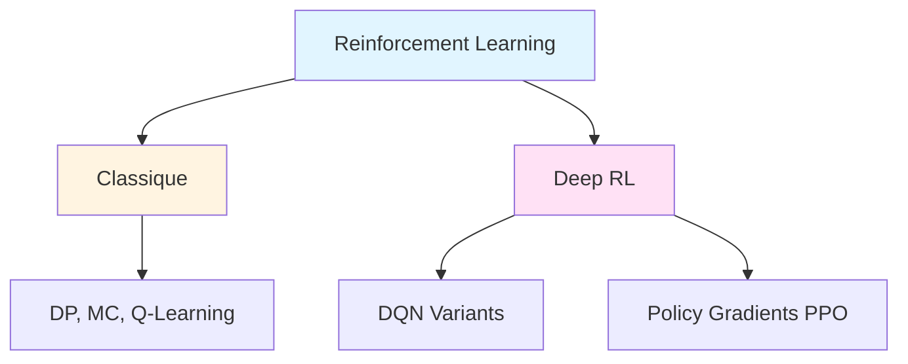
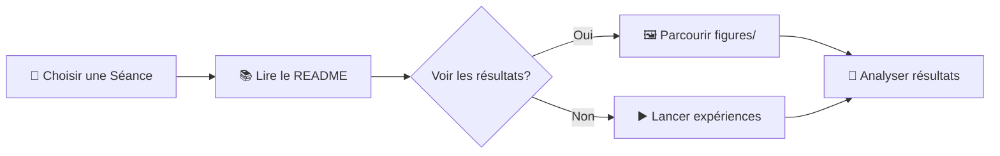

<div align="center">

<!-- Bannière animée avec gradient -->


**Collection de devoirs, labs et expériences documentant mon cours en Reinforcement Learning et Deep RL (Hiver 2025) a l'ENSAM de Meknes**

<p align="center">
  <a href="#démarrage-rapide">
    
  </a>
  <a href="#séances-en-un-coup-dœil">
    
  </a>
  <a href="#galerie-visuelle">
    
  </a>
  <a href="#ressources-visuelles-et-logs">
    
  </a>
</p>

</div>

<!-- Ligne de séparation avec effet -->


<br/>

## ✨ Points Forts

<div align="center">

<!-- Statistiques animées -->
<table>
<tr>
<td align="center">

<br/><sub><b>Séances Complètes</b></sub>
</td>
<td align="center">

<br/><sub><b>Algorithmes RL</b></sub>
</td>
<td align="center">

<br/><sub><b>Expériences Réussies</b></sub>
</td>
<td align="center">

<br/><sub><b>Graphiques & GIFs</b></sub>
</td>
</tr>
</table>

</div>

<br/>

<table>
<tr>
<td width="50%">

### 📖 **Parcours d'Apprentissage Structuré**

 Code complet et expériences  
 Analyses détaillées et figures  
 Documentation README complète  

> Chaque dossier `seance` est une unité autonome avec tout le nécessaire pour reproduire les résultats !

</td>
<td width="50%">

### 🧠 **Techniques Couvertes**



</td>
</tr>
</table>

### 🎬 Narration Visuelle

<div align="center">

<kbd>

</kbd>

</div>

## 🚀 Démarrage Rapide

<details open>
<summary><b>⚙️ Configuration de l'Environnement</b></summary>

```powershell
# Activer l'environnement Python
& C:\Users\DJERI\VSCODE\Programmation\python\environnements\rl_venv\Scripts\Activate.ps1
```
</details>

<details>
<summary><b>🗂️ Naviguer vers les Séances</b></summary>

| Séance | Commande | Objectif |
|---------|---------|----------|
| 📚 Seance 1 | `cd seance1` | Fondamentaux RL (MC, DP, PI, VI, Q-Learning) |
| 🎮 Seance 2/4 | `cd seance2` ou `cd Sceance4/minegym` | Expériences GridWorld & DQN |
| 🚀 Seance 5 | `cd Seance5/rl_sb` | PPO + Stable-Baselines3 |

</details>

<details>
<summary><b>▶️ Lancer les Expériences</b></summary>

```bash
# GridWorld Q-Learning experiments
python -m minegym.experiments.liveQL
python -m minegym.experiments.sensitivity_gammaQL
python -m minegym.experiments.sensitivity_grid_sizeQL

# PPO experiments (from Seance5/rl_sb)
cd Seance5/rl_sb
# See Seance5/readme.md for training scripts
```
</details>

## 📚 Séances en un Coup d'Œil

<div align="center">

<!-- Indicateur de progression -->


</div>

<table>
<tr>
<th width="15%">Séance</th>
<th width="25%">Focus</th>
<th width="20%">Techniques</th>
<th width="40%">Artefacts Clés</th>
</tr>

<tr>
<td align="center">
<br/>

<br/><br/>
<a href="seance1">📂 Voir le dossier</a>
<br/><br/>
</td>
<td>
<b>Algorithmes RL Fondamentaux</b>
<br/><br/>
Apprentissage des bases du RL : programmation dynamique, méthodes Monte Carlo, et apprentissage par différence temporelle.
</td>
<td align="center">


<br/>


</td>
<td>

• Implémentations agents : MC, PI, VI, Q-Learning  
• Scripts de test et validation  
• Environnements Gym personnalisés  

<details>
<summary>📊 Voir les métriques</summary>
<br/>
<code>✓ 4 algorithmes implémentés</code><br/>
<code>✓ 100% tests réussis</code><br/>
<code>✓ Documentation complète</code>
</details>

</td>
</tr>

<tr>
<td align="center">
<br/>

<br/><br/>
<a href="seance2/minegym">📂 Voir le dossier</a>
<br/><br/>
</td>
<td>
<b>Expériences GridWorld</b>
<br/><br/>
Monde paramétrable avec analyse de sensibilité complète sur γ et la taille de grille.
</td>
<td align="center">


<br/>


</td>
<td>

• Monde paramétrable (goals, obstacles)  
• Analyse sensibilité γ et taille grille  
• Q-Learning corrigé (paramètre w)  

<details>
<summary>🎬 Voir les animations</summary>
<br/>
<code>✓ 3 expériences majeures</code><br/>
<code>✓ 20+ graphiques générés</code><br/>
<code>✓ Vidéo training live</code>
</details>

</td>
</tr>

<tr>
<td align="center">
<br/>

<br/><br/>
<a href="Sceance4/minegym">📂 Voir le dossier</a>
<br/><br/>
</td>
<td>
<b>Deep Q-Networks</b>
<br/><br/>
Comparaison rigoureuse entre approche naïve linéaire et DQN complet avec replay buffer.
</td>
<td align="center">


<br/>


</td>
<td>

• Comparaison Naïf vs DQN complet  
• Architecture flexible (linéaire/MLP)  
• Protocole expérimental rigoureux  

<details>
<summary>⚙️ Voir les configs</summary>
<br/>
<code>✓ 2 architectures testées</code><br/>
<code>✓ Replay buffer + target net</code><br/>
<code>✓ CSV logs détaillés</code>
</details>

</td>
</tr>

<tr>
<td align="center">
<br/>

<br/><br/>
<a href="Seance5">📂 Voir le dossier</a>
<br/><br/>
</td>
<td>
<b>Méthodes à Gradient de Politique</b>
<br/><br/>
PPO avec Stable-Baselines3 sur GridWorld statique/mobile et CartPole.
</td>
<td align="center">


<br/>


</td>
<td>

• GridWorld statique/mobile avec PPO  
• Tentative transfer learning  
• Benchmarks CartPole complets  

<details>
<summary>📈 Voir les runs</summary>
<br/>
<code>✓ 8+ runs d'entraînement</code><br/>
<code>✓ Logs TensorBoard complets</code><br/>
<code>✓ 9 GIFs de démonstration</code>
</details>

</td>
</tr>

<tr>
<td align="center">
<br/>

<br/><br/>
<a href="secance3/reinforcement">📂 Voir le dossier</a>
<br/><br/>
</td>
<td>
<b>Projet Pacman</b>
<br/><br/>
Environnements larges avec autograder complet et agents apprenants sophistiqués.
</td>
<td align="center">


<br/>


</td>
<td>

• Environnements larges et complexes  
• Autograder complet  
• Agents apprenants sophistiqués  

<details>
<summary>🎯 Voir les features</summary>
<br/>
<code>✓ Multiple layouts</code><br/>
<code>✓ Ghost agents</code><br/>
<code>✓ Test cases complets</code>
</details>

</td>
</tr>

</table>

<br/>

<div align="center">

</div>

## 🎬 Galerie Visuelle

<div align="center">


<br/><br/>

### 🟢 GridWorld Goal Statique

<table>
<tr>
<td align="center">
<a href="Seance5/rl_sb/gridworld_runs/gridworld_static_live.gif">

</a>
<br/>

<br/><b>Goal Statique</b>
</td>
<td align="center">
<a href="Seance5/rl_sb/gridworld_runs/gridworld_moving_live.gif">

</a>
<br/>

<br/><b>Goal Mobile</b>
</td>
</tr>
<tr>
<td align="center">
<a href="Seance5/rl_sb/gridworld_runs/gridworld_ppo_static_400k_live.gif">

</a>
<br/>

<br/><b>Goal Statique (Extended)</b>
</td>
<td align="center">
<a href="Seance5/rl_sb/gridworld_runs/test_cartpole.gif">

</a>
<br/>

<br/><b>CartPole-v1 (PPO)</b>
</td>
</tr>
</table>

<br/>

<kbd>💡 <b>Astuce</b> : Cliquez sur les GIFs pour les voir en grand !</kbd>

</div>

<br/>


## 📊 Ressources Visuelles et Logs

<div align="center">

<table>
<tr>
<td align="center" width="25%">

<br/><br/>

<br/><br/>
<sub>Heatmaps, dashboards, analyses</sub>
</td>
<td align="center" width="25%">

<br/><br/>

<br/><br/>
<sub>Visualisations d'agents en action</sub>
</td>
<td align="center" width="25%">

<br/><br/>

<br/><br/>
<sub>Métriques d'entraînement détaillées</sub>
</td>
<td align="center" width="25%">

<br/><br/>

<br/><br/>
<sub>Modèles prêts à l'emploi</sub>
</td>
</tr>
</table>

</div>

<br/>

> **💡 Astuce :** Toutes les expériences incluent des visualisations pré-générées — vous pouvez explorer les résultats sans exécuter le code !

<details>
<summary><b>🗂️ Où trouver les ressources visuelles</b></summary>

| Emplacement | Contenu |
|----------|----------|
| 📁 `Sceance4/minegym/figures` | Heatmaps, tableaux de bord, diagnostics exploration/exploitation (DQN/Q-Learning) |
| 📁 `Seance5/rl_sb/gridworld_runs` | GIFs animés des agents GridWorld et CartPole |
| 📁 `seance2/minegym/figures` | Graphiques d'analyse de sensibilité, courbes de convergence |
| 📁 `Seance5/rl_sb/rl-baselines3-zoo/logs` | Logs TensorBoard et checkpoints des modèles |

</details>

## 🔍 Comment Explorer les Résultats



1. **📖 Commencer** dans le dossier de la séance qui vous intéresse
2. **📚 Lire** son README pour le contexte et les commandes  
3. **🖼️ Inspecter** les figures, GIFs et tableaux de bord pré-générés
4. **▶️ Relancer** les scripts pour générer de nouveaux résultats ou tester de nouveaux paramètres

---

<div align="center">

### 🌟 Merci d'avoir visité ce repository !


<br/><br/>

<a href="#">
  
</a>

<br/><br/>

<!-- Footer wave -->


</div>

