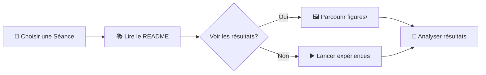

<div align="center">

# 🎯 Reinforcement Learning & Deep RL Labs
## Portfolio 2025


**Collection de devoirs, labs et expériences documentant mon parcours en Reinforcement Learning et Deep RL (Hiver 2025)**

[🚀 Démarrage Rapide](#démarrage-rapide) • [📚 Séances](#séances-en-un-coup-dœil) • [🎬 Démos](#galerie-visuelle) • [📊 Résultats](#ressources-visuelles-et-logs)

</div>

---

## ✨ Points Forts

<table>
<tr>
<td width="50%">

### 📖 **Parcours d'Apprentissage Structuré**
Chaque dossier `seance` contient :
- 📝 Code complet et expériences
- 📊 Analyses détaillées et figures
- 📚 Documentation README complète

</td>
<td width="50%">

### 🧠 **Techniques Couvertes**
- 🎲 RL Classique : DP, MC, Q-Learning
- 🎮 Deep RL : variantes DQN
- 🚀 Avancé : PPO avec Stable-Baselines3

</td>
</tr>
</table>

### 🎬 Narration Visuelle
Toutes les expériences incluent des **visualisations animées** (GIFs) et des **tableaux de bord interactifs** pour observer le comportement des agents sans exécuter le code !

## 🚀 Démarrage Rapide

<details open>
<summary><b>⚙️ Configuration de l'Environnement</b></summary>

```powershell
# Activer l'environnement Python
& C:\Users\DJERI\VSCODE\Programmation\python\environnements\rl_venv\Scripts\Activate.ps1
```
</details>

<details>
<summary><b>🗂️ Naviguer vers les Séances</b></summary>

| Séance | Commande | Objectif |
|---------|---------|----------|
| 📚 Seance 1 | `cd seance1` | Fondamentaux RL (MC, DP, PI, VI, Q-Learning) |
| 🎮 Seance 2/4 | `cd seance2` ou `cd Sceance4/minegym` | Expériences GridWorld & DQN |
| 🚀 Seance 5 | `cd Seance5/rl_sb` | PPO + Stable-Baselines3 |

</details>

<details>
<summary><b>▶️ Lancer les Expériences</b></summary>

```bash
# GridWorld Q-Learning experiments
python -m minegym.experiments.liveQL
python -m minegym.experiments.sensitivity_gammaQL
python -m minegym.experiments.sensitivity_grid_sizeQL

# PPO experiments (from Seance5/rl_sb)
cd Seance5/rl_sb
# See Seance5/readme.md for training scripts
```
</details>

## 📚 Séances en un Coup d'Œil

<table>
<tr>
<th>Séance</th>
<th>Focus</th>
<th>Techniques</th>
<th>Artefacts Clés</th>
</tr>

<tr>
<td><b>📖 <a href="seance1">Seance 1</a></b></td>
<td>Algorithmes RL Fondamentaux</td>
<td>


</td>
<td>Implémentations agents : MC, PI, VI, Q-Learning</td>
</tr>

<tr>
<td><b>🎮 <a href="seance2/minegym">Seance 2</a></b></td>
<td>Expériences GridWorld</td>
<td>


</td>
<td>Monde paramétrable, analyse de sensibilité, Q-Learning corrigé</td>
</tr>

<tr>
<td><b>🤖 <a href="Sceance4/minegym">Seance 4</a></b></td>
<td>Deep Q-Networks</td>
<td>


</td>
<td>Comparaison Naïf vs DQN, architecture flexible</td>
</tr>

<tr>
<td><b>🚀 <a href="Seance5">Seance 5</a></b></td>
<td>Méthodes à Gradient de Politique</td>
<td>


</td>
<td>GridWorld statique/mobile, CartPole, transfer learning</td>
</tr>

<tr>
<td><b>👾 <a href="secance3/reinforcement">Seance 3</a></b></td>
<td>Projet Pacman</td>
<td>


</td>
<td>Environnements larges, autograder, agents apprenants</td>
</tr>

</table>

## 🎬 Galerie Visuelle

<div align="center">

### Entraînement Agent GridWorld (PPO)

<table>
<tr>
<td align="center">

<br/><b>Goal Statique (100k steps)</b>
</td>
<td align="center">

<br/><b>Goal Mobile (100k steps)</b>
</td>
</tr>
<tr>
<td align="center">

<br/><b>Goal Statique (400k steps)</b>
</td>
<td align="center">

<br/><b>CartPole-v1 (PPO)</b>
</td>
</tr>
</table>

</div>

---

## 📊 Ressources Visuelles et Logs

> **💡 Astuce :** Toutes les expériences incluent des visualisations pré-générées — vous pouvez explorer les résultats sans exécuter le code !

<details>
<summary><b>🗂️ Où trouver les ressources visuelles</b></summary>

| Emplacement | Contenu |
|----------|----------|
| 📁 `Sceance4/minegym/figures` | Heatmaps, tableaux de bord, diagnostics exploration/exploitation (DQN/Q-Learning) |
| 📁 `Seance5/rl_sb/gridworld_runs` | GIFs animés des agents GridWorld et CartPole |
| 📁 `seance2/minegym/figures` | Graphiques d'analyse de sensibilité, courbes de convergence |
| 📁 `Seance5/rl_sb/rl-baselines3-zoo/logs` | Logs TensorBoard et checkpoints des modèles |

</details>

## 🔍 Comment Explorer les Résultats



1. **📖 Commencer** dans le dossier de la séance qui vous intéresse
2. **📚 Lire** son README pour le contexte et les commandes  
3. **🖼️ Inspecter** les figures, GIFs et tableaux de bord pré-générés
4. **▶️ Relancer** les scripts pour générer de nouveaux résultats ou tester de nouveaux paramètres

---

<div align="center">

**📫 Questions ou commentaires ?** Ouvrez une issue ou contactez-moi !

⭐ **Star ce repo** si vous l'avez trouvé utile !

</div>

