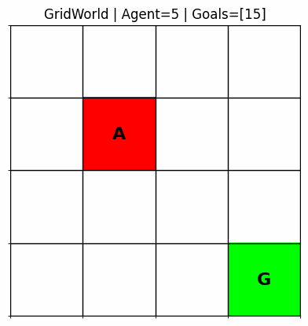
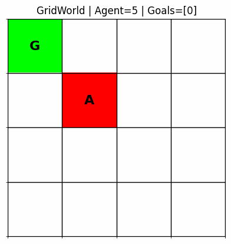
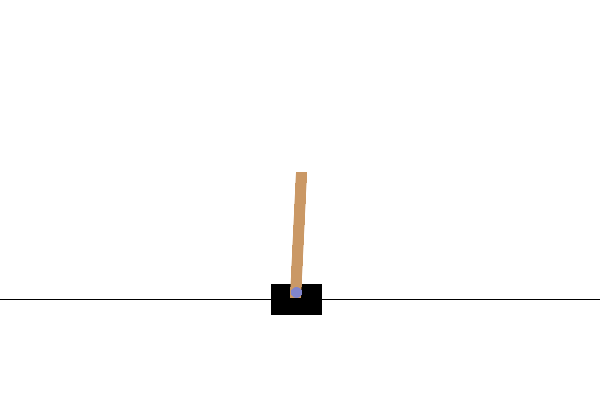

<div align="center">


<br/>


<br/><br/>


[](VISUAL_ANALYSIS.md)
[](SUMMARY.md)

<br/>

**Collection de devoirs, labs et expériences documentant mon cours en Reinforcement Learning et Deep RL**  
**École Nationale Supérieure des Arts et Métiers - Meknès**
(ps si le prof vous dit que il notera vos depot il ment de ouf . il le fera pas (ps je vais pas dire sont nom pour respect mais chercher le prof de RL de la 4em anne en 2026 ) et bye 
</div>

<br/>


## ✨ Points Forts

- **Historique structuré** : chaque dossier `seance` contient le code, scripts d'expériences, figures et résultats
- **Techniques couvertes** : de la programmation dynamique classique, Monte Carlo et Q-Learning jusqu'aux variantes DQN et expériences PPO
- **Narration visuelle** : GIFs et figures disponibles pour inspecter le comportement des agents sans exécuter le code

## 🚀 Démarrage Rapide

<details open>
<summary><b>⚙️ 1. Activer l'environnement Python</b></summary>

```powershell
& C:\Users\DJERI\VSCODE\Programmation\python\environnements\rl_venv\Scripts\Activate.ps1
```
</details>

<details>
<summary><b>📂 2. Naviguer vers la séance souhaitée</b></summary>

| Séance | Commande | Contenu |
|--------|----------|----------|
| 📚 Seance 1 | `cd seance1` | Fondamentaux RL (MC, DP, PI, VI, Q-Learning) |
| 🎮 Seance 2 | `cd seance2` | GridWorld & Q-Learning |
| 🤖 Seance 4 | `cd Sceance4/minegym` | DQN & comparaisons |
| 🚀 Seance 5 | `cd Seance5/rl_sb` | PPO + Stable-Baselines3 |

</details>

<details>
<summary><b>▶️ 3. Lancer les expériences</b></summary>

```bash
# Expériences GridWorld Q-Learning
python -m minegym.experiments.liveQL
python -m minegym.experiments.sensitivity_gammaQL
python -m minegym.experiments.sensitivity_grid_sizeQL

# Expériences PPO (depuis Seance5/rl_sb)
cd Seance5/rl_sb
# Voir Seance5/readme.md pour les scripts d'entraînement
```
</details>

## 📚 Séances en un Coup d'Œil

<div align="center">

</div>

<br/>

<table>
<tr>
<th width="15%">Séance</th>
<th width="40%">Focus</th>
<th width="45%">Artefacts Clés</th>
</tr>

<tr>
<td align="center">
<br/>

<br/><br/>
<a href="seance1">📂 Voir dossier</a>
</td>
<td>
<b>Algorithmes RL Fondamentaux</b>
<br/><br/>
Monte Carlo, programmation dynamique, itération de politique, itération de valeur, Q-Learning tabulaire
</td>
<td>
• Agents : MC, PI, VI, Q-Learning<br/>
• Scripts de test et validation<br/>
• Environnements Gym personnalisés<br/>
<br/>

</td>
</tr>

<tr>
<td align="center">
<br/>

<br/><br/>
<a href="seance2/minegym">📂 Voir dossier</a>
</td>
<td>
<b>GridWorld Paramétrable</b>
<br/><br/>
Q-Learning avec diagnostics complets, analyse de sensibilité sur γ et taille de grille
</td>
<td>
• Environnement configurable<br/>
• Expériences : liveQL, sensitivity_gamma, sensitivity_grid<br/>
• Mise à jour corrigée avec paramètre w<br/>
<br/>

</td>
</tr>

<tr>
<td align="center">
<br/>

<br/><br/>
<a href="Sceance4/minegym">📂 Voir dossier</a>
</td>
<td>
<b>Deep Q-Networks</b>
<br/><br/>
Comparaison naïf vs DQN complet avec replay buffer et target network
</td>
<td>
• Architectures : linéaire et MLP<br/>
• Documentation : README.md et DQNReadme.md<br/>
• Protocole expérimental rigoureux<br/>
<br/>

</td>
</tr>

<tr>
<td align="center">
<br/>

<br/><br/>
<a href="Seance5">📂 Voir dossier</a>
</td>
<td>
<b>Policy Gradient Methods</b>
<br/><br/>
PPO avec Stable-Baselines3 sur GridWorld statique/mobile et CartPole
</td>
<td>
• Environnements : GridWorld et CartPole<br/>
• Framework : Stable-Baselines3 + rl-baselines3-zoo<br/>
• Logs TensorBoard et checkpoints<br/>
<br/>

</td>
</tr>

<tr>
<td align="center">
<br/>

<br/><br/>
<a href="secance3/reinforcement">📂 Voir dossier</a>
</td>
<td>
<b>Projet Pacman</b>
<br/><br/>
Environnements complexes avec autograder et agents apprenants sophistiqués
</td>
<td>
• Environnements larges<br/>
• Autograder complet<br/>
• Agents apprenants<br/>
<br/>

</td>
</tr>

</table>

## 🎬 Galerie Visuelle

<div align="center">

<table>
<tr>
<td align="center" width="50%">
<a href="Seance5/rl_sb/gridworld_runs/gridworld_static_live.gif">

</a>
<br/><br/>
<b>GridWorld Statique (PPO)</b>
</td>
<td align="center" width="50%">
<a href="Seance5/rl_sb/gridworld_runs/gridworld_moving_live.gif">

</a>
<br/><br/>
<b>GridWorld Mobile (PPO)</b>
</td>
</tr>
<tr>
<td align="center" width="50%">
<a href="Seance5/rl_sb/gridworld_runs/gridworld_ppo_static_400k_live.gif">

</a>
<br/><br/>
<b>GridWorld Extended Training</b>
</td>
<td align="center" width="50%">
<a href="Seance5/rl_sb/gridworld_runs/test_cartpole.gif">

</a>
<br/><br/>
<b>CartPole-v1 (PPO)</b>
</td>
</tr>
</table>

</div>

## 📊 Ressources Visuelles et Logs - Guide Complet

<div align="center">

### 🎨 Navigation Rapide vers les Analyses Visuelles

[](VISUAL_ANALYSIS.md)

**🔗 [Voir VISUAL_ANALYSIS.md](VISUAL_ANALYSIS.md)** pour le catalogue exhaustif de tous les fichiers visuels avec analyses détaillées et justifications.

</div>

<br/>

<details open>
<summary><b>📸 Séance 2 - GridWorld Q-Learning (27 Images + 1 CSV)</b></summary>

<table>
<tr>
<th>Catégorie</th>
<th>Nb Files</th>
<th>Contenu</th>
<th>Lien</th>
</tr>
<tr>
<td>🎯 <b>LiveQL</b></td>
<td>7 PNG</td>
<td>V*, π*, visits, actions, dashboard, explore/exploit</td>
<td><a href="seance2/minegym#-galerie-complète-des-résultats-visuels">🔗 Voir</a></td>
</tr>
<tr>
<td>📊 <b>Sensitivity Gamma</b></td>
<td>6 PNG</td>
<td>Convergence, time-to-threshold, final perf, episode length</td>
<td><a href="seance2/minegym#-analyse-de-sensibilité-γ-sensitivity_gamma">🔗 Voir</a></td>
</tr>
<tr>
<td>📐 <b>Sensitivity Grid Size</b></td>
<td>5 PNG</td>
<td>Impact taille grille (4×4 → 10×10)</td>
<td><a href="seance2/minegym#-analyse-de-sensibilité-taille-grille-sensitivity_grid_size">🔗 Voir</a></td>
</tr>
<tr>
<td>🧪 <b>Comparaisons Algo</b></td>
<td>9 PNG + 1 CSV</td>
<td>TD(0), SARSA, DQN - heatmaps, politiques, convergence</td>
<td><a href="seance2/minegym#-comparaisons-algorithmiques-exp_td0-exp_sarsa-exp_dqn">🔗 Voir</a></td>
</tr>
</table>

**💡 Contenu** : Analyses de sensibilité complètes (γ, grid size), dashboards 6-en-1, heatmaps annotées, comparaisons TD/SARSA/DQN

</details>

<details>
<summary><b>🤖 Séance 4 - DQN Flexible (10 Images + 1 CSV)</b></summary>

<table>
<tr>
<th>Catégorie</th>
<th>Nb Files</th>
<th>Contenu</th>
<th>Lien</th>
</tr>
<tr>
<td>🎯 <b>Politique & Valeur</b></td>
<td>3 PNG</td>
<td>V* heatmap, π* grid, policy-value overlay</td>
<td><a href="Sceance4/minegym#-résultats-globaux---politique--valeurs">🔗 Voir</a></td>
</tr>
<tr>
<td>📈 <b>Training Metrics</b></td>
<td>4 PNG</td>
<td>Loss MSE, steps/episode, ε/||θ||, loss vs return</td>
<td><a href="Sceance4/minegym#-métriques-dentraînement---convergence--diagnostics">🔗 Voir</a></td>
</tr>
<tr>
<td>🗺️ <b>Analyses Spatiales</b></td>
<td>2 PNG</td>
<td>Visits heatmap, dominant actions</td>
<td><a href="Sceance4/minegym#️-analyses-comportementales">🔗 Voir</a></td>
</tr>
<tr>
<td>📊 <b>Dashboard + Logs</b></td>
<td>1 PNG + 1 CSV</td>
<td>Summary 6-en-1, naive_logs.csv (episode, loss, return...)</td>
<td><a href="Sceance4/minegym#-dashboard-récapitulatif">🔗 Voir</a></td>
</tr>
</table>

**💡 Contenu** : Comparaison Naive vs DQN complet, courbes de loss/convergence, scatter plots, diagnostics complets

</details>

<details>
<summary><b>🚀 Séance 5 - PPO Stable-Baselines3 (8 GIFs + 8 Images + CSVs)</b></summary>

<table>
<tr>
<th>Catégorie</th>
<th>Nb Files</th>
<th>Contenu</th>
<th>Lien</th>
</tr>
<tr>
<td>🟢 <b>GridWorld Static</b></td>
<td>3 GIFs + 2 PNG</td>
<td>50k/100k/400k steps, reward/length curves</td>
<td><a href="Seance5#-gridworld-statique---évolution-des-métriques">🔗 Voir</a></td>
</tr>
<tr>
<td>🔵 <b>GridWorld Moving</b></td>
<td>3 GIFs + 4 PNG</td>
<td>100k/400k/600k steps, comparaison convergence</td>
<td><a href="Seance5#-gridworld-mobile---apprentissage-adaptatif">🔗 Voir</a></td>
</tr>
<tr>
<td>🔄 <b>Fine-tuning + CartPole</b></td>
<td>2 GIFs</td>
<td>Transfert Static→Moving, CartPole solved</td>
<td><a href="Seance5#-transfert-learning--cartpole">🔗 Voir</a></td>
</tr>
<tr>
<td>📂 <b>Monitor CSVs</b></td>
<td>~8 CSV</td>
<td>Logs épisodes (r, l, t) pour analyses custom</td>
<td><a href="Seance5#-fichiers-csv---monitor-logs">🔗 Voir</a></td>
</tr>
</table>

**💡 Contenu** : TensorBoard plots, agents animés (GIFs), comparaison static vs moving, transfer learning

</details>

<br/>

<div align="center">

### 📊 Récapitulatif Global

| Séance | Images PNG | GIFs | CSV | Total | Focus Visuel |
|--------|-----------|------|-----|-------|-------------|
| **Seance 2** | 27 | 0 | 1 | 28 | Heatmaps, dashboards, sensibilité |
| **Seance 4** | 10 | 0 | 1 | 11 | Loss curves, DQN diagnostics |
| **Seance 5** | 8 | 8 | ~8 | ~24 | TensorBoard, agents animés |
| **TOTAL** | **45** | **8** | **~10** | **~63** | **Analyses complètes multi-algo** |

</div>

**🔍 Navigation** : Cliquez sur les liens "🔗 Voir" ci-dessus pour accéder directement aux sections détaillées avec analyses et justifications de chaque image.

<br/>

<table>
<tr>
<td width="33%" align="center">
<br/>
📈 <b>Graphiques d'Analyse</b>
<br/><br/>
<code>Sceance4/minegym/figures</code>
<br/><br/>
Heatmaps, dashboards, diagnostics<br/>DQN/QL
<br/><br/>
</td>
<td width="33%" align="center">
<br/>
🎬 <b>GIFs Animés</b>
<br/><br/>
<code>Seance5/rl_sb/gridworld_runs</code>
<br/><br/>
Agents GridWorld et CartPole<br/>en action
<br/><br/>
</td>
<td width="33%" align="center">
<br/>
💾 <b>Logs & Checkpoints</b>
<br/><br/>
<code>Seance5/rl_sb/.../logs</code>
<br/><br/>
TensorBoard logs et<br/>modèles sauvegardés
<br/><br/>
</td>
</tr>
</table>

## 🔍 Comment Explorer

1. **Choisir** la séance qui vous intéresse dans le tableau ci-dessus
2. **Lire** le README spécifique pour le contexte et les commandes
3. **Visualiser** les figures et GIFs pré-générés
4. **Re-lancer** les expériences si nécessaire pour de nouveaux paramètres

---

## 📚 Documentation Complète

<div align="center">

<table>
<tr>
<td align="center" width="33%">
<br/>
<a href="SUMMARY.md">

</a>
<br/><br/>
Vue d'ensemble en 1 page<br/>Statistiques et navigation
<br/><br/>
</td>
<td align="center" width="33%">
<br/>
<a href="VISUAL_ANALYSIS.md">

</a>
<br/><br/>
55 fichiers catalogués<br/>Analyses + justifications
<br/><br/>
</td>
<td align="center" width="33%">
<br/>
<a href="RAPPORT_INTEGRATION.md">

</a>
<br/><br/>
Méthodologie complète<br/>Checklist + impact
<br/><br/>
</td>
</tr>
</table>

</div>

---

<div align="center">

<br/>


<br/><br/>


</div>

