<div align="center">


<br/>


<br/>

**Environnements GridWorld configurables avec diagnostics Q-Learning complets**

</div>

<br/>


---

## 🎓 Note Pédagogique : L'Héritage du Q-Learning

### 🏛️ Le Contexte Historique
Il est impossible de comprendre l'apprentissage par renforcement moderne sans rendre hommage à **Chris Watkins**. En 1989, dans sa thèse de doctorat à Cambridge intitulée *"Learning from Delayed Rewards"*, il a introduit l'algorithme **Q-Learning**.

Avant Watkins, le domaine était dominé par la Programmation Dynamique (qui nécessite un modèle parfait de l'environnement) et les méthodes Monte Carlo (qui nécessitent d'attendre la fin d'un épisode). Watkins a proposé une idée révolutionnaire : apprendre la qualité d'une action (la "Quality" ou **Q-value**) étape par étape, sans attendre la fin de l'épisode et surtout, **sans suivre la politique actuelle**.

### 💡 Le Principe Fondamental : Off-Policy vs On-Policy
La distinction majeure que vous devez saisir dans cette séance est celle entre **Q-Learning** et **SARSA** (introduit plus tard par Rummery & Niranjan en 1994).

*   **Q-Learning (Off-Policy)** : C'est l'audacieux. Il apprend la valeur de l'action *optimale* ($max Q(s', a')$), même s'il est en train d'explorer aléatoirement. C'est comme apprendre à jouer aux échecs en regardant un grand maître, tout en jouant soi-même n'importe comment.
    *   *Force* : Converge vers la solution optimale théorique ($Q^*$) indépendamment de la façon dont on explore (tant qu'on explore tout).
*   **SARSA (On-Policy)** : C'est le prudent. Il apprend la valeur de l'action *qu'il va réellement prendre* ($Q(s', a')$ selon sa politique actuelle). Il "paie" pour ses erreurs d'exploration.
    *   *Force* : Apprend une politique plus sûre pendant l'entraînement (évite les falaises si l'exploration est dangereuse).

### 🔬 Pourquoi le GridWorld ?
Vous pourriez penser que le GridWorld (monde en grille) est simpliste. Détrompez-vous. C'est la **Drosophile du Reinforcement Learning** (l'organisme modèle par excellence).
*   **Transparence** : Contrairement à un réseau de neurones "boîte noire", ici nous pouvons *voir* chaque valeur de Q dans un tableau.
*   **Diagnostic** : Si l'agent ne contourne pas un mur, nous savons exactement pourquoi (la propagation de la récompense est bloquée).
*   **Universalité** : Les problèmes de navigation, de labyrinthe et de planification de trajectoire sont les fondements de la robotique mobile.

> **📚 Référence Incontournable :**
> *Watkins, C. J. C. H., & Dayan, P. (1992). Q-learning. Machine learning, 8(3), 279-292.*

---

## 🎯 Aperçu

Cette session rend tous les composants du GridWorld configurables (goals, obstacles, cibles mobiles) et se concentre sur l'agent Q-Learning dont le comportement est résumé dans les graphiques sous `figures/goal`.

## 🚀 Démarrage Rapide

<details open>
<summary><b>⚙️ 1. Activer l'environnement</b></summary>

```powershell
& C:\Users\DJERI\VSCODE\Programmation\python\environnements\rl_venv\Scripts\Activate.ps1
```
</details>

<details>
<summary><b>▶️ 2. Lancer les expériences</b></summary>

```bash
cd seance2
python -m minegym.experiments.liveQL
python -m minegym.experiments.sensitivity_gammaQL
python -m minegym.experiments.sensitivity_grid_sizeQL
```
</details>

<details>
<summary><b>📊 3. Visualiser les résultats</b></summary>

Consultez les dashboards, GIFs et heatmaps dans `figures/goal` ou visualisez `live_training.mp4` pour observer la stratégie de l'agent.
</details>

## 🧪 Suite d'Expériences

<table>
<tr>
<th>📝 Script</th>
<th>🎯 Objectif</th>
<th>📄 Sortie</th>
</tr>
<tr>
<td><code>liveQL</code></td>
<td>Surveiller l'agent avec un flux Matplotlib en direct et logger les dynamiques de récompenses/ε pendant que le GridWorld s'exécute</td>
<td>
• <code>live_training.mp4</code><br/>
• Dashboards de récompenses<br/>
• Heatmaps de politique<br/>
• Visualisations dominance d'actions
</td>
</tr>
<tr>
<td><code>sensitivity_gammaQL</code></td>
<td>Comparer la vitesse de convergence, récompense finale et avidité d'exploration pour plusieurs valeurs de γ</td>
<td>
• Figures <code>sensitivity_gamma_*</code><br/>
• Graphiques avec intervalles de confiance<br/>
• Courbes de croissance<br/>
• Sous-graphiques proportion greedy
</td>
</tr>
<tr>
<td><code>sensitivity_grid_sizeQL</code></td>
<td>Comparer les mêmes statistiques quand la grille augmente de 4×4 à 10×10</td>
<td>
• Figures <code>sensitivity_grid_*</code><br/>
• Courbes de convergence<br/>
• Barres de récompense finale<br/>
• Portraits d'exploration
</td>
</tr>
</table>

## 📐 Mise à Jour Q-Learning Corrigée (paramètre w)

Au lieu de la cible TD classique, cette séance demande un terme de correction `w` qui met à l'échelle la mise à jour des valeurs d'action :

$$Q(s,a) \leftarrow Q(s,a) + \alpha \cdot w \cdot \left[r + \gamma \max_{a'} Q(s',a') - Q(s,a)\right]$$

où `w` ajuste l'agressivité avec laquelle la valeur tabulaire se déplace vers la cible TD lorsque le monde change (goals mobiles, nouveaux obstacles). Essayez des valeurs entre 0.5 et 1.2 et comparez la vitesse de stabilisation des courbes de récompense.

## 🖼️ Résumé des Sorties Visuelles

<div align="center">

<table>
<tr>
<td align="center" width="50%">

<br/><br/>
<b>Heatmap Fonction de Valeur</b>
</td>
<td align="center" width="50%">

<br/><br/>
<b>Grille Politique Optimale</b>
</td>
</tr>
<tr>
<td align="center" width="50%">

<br/><br/>
<b>Distribution Visites États</b>
</td>
<td align="center" width="50%">

<br/><br/>
<b>Actions Dominantes</b>
</td>
</tr>
</table>

### 📊 Analyse de Sensibilité

<table>
<tr>
<td align="center">

<br/><br/>
<b>Sensibilité γ : Convergence avec Intervalles de Confiance</b>
</td>
</tr>
<tr>
<td align="center">

<br/><br/>
<b>Sensibilité Taille Grille : Courbes de Convergence</b>
</td>
</tr>
</table>

</div>

---

## ⚙️ Modifier l'environnement GridEnv

Le fichier principal pour régler la logique du monde est : `minegym/envs/gridworld.py`

---

## 📊 Galerie Complète des Résultats Visuels

Cette section présente **toutes les visualisations générées** par les expériences, avec analyse de leur utilité.

### 🎯 LiveQL - Entraînement en Direct (liveQLgoalsfixed/)

<details open>
<summary><b>📹 Visualisations Principales</b></summary>

<table>
<tr>
<td align="center" width="33%">

<br/><br/>
<b>🌡️ Heatmap V*</b>
<br/>
<sub><i>Fonction de valeur optimale apprise</i></sub>
</td>
<td align="center" width="33%">

<br/><br/>
<b>🧭 Politique Optimale</b>
<br/>
<sub><i>Flèches indiquant la meilleure action par état</i></sub>
</td>
<td align="center" width="33%">
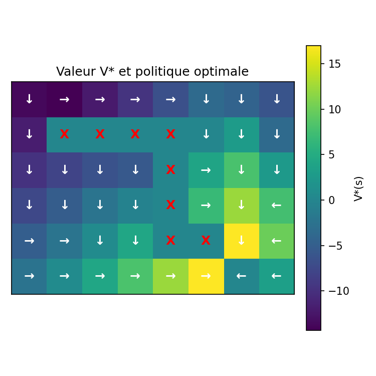
<br/><br/>
<b>🎯 Politique + Valeurs</b>
<br/>
<sub><i>Combinaison V* et π*</i></sub>
</td>
</tr>
</table>

**📝 Analyse :**
- **V_star_heatmap** : Montre que les valeurs augmentent en se rapprochant du goal (cases chaudes = proches du but)
- **pi_star_grid** : Politique cohérente - toutes les flèches convergent vers le goal
- **policy_value** : Superposition permettant de valider que π* extrait bien l'action qui maximise V*

</details>

<details>
<summary><b>📈 Analyses Comportementales</b></summary>

<table>
<tr>
<td align="center" width="50%">

<br/><br/>
<b>🗺️ Distribution des Visites</b>
<br/>
<sub><i>Heatmap des états explorés</i></sub>
</td>
<td align="center" width="50%">

<br/><br/>
<b>🎲 Actions Dominantes</b>
<br/>
<sub><i>Action la plus fréquente par état</i></sub>
</td>
</tr>
<tr>
<td align="center" width="50%">
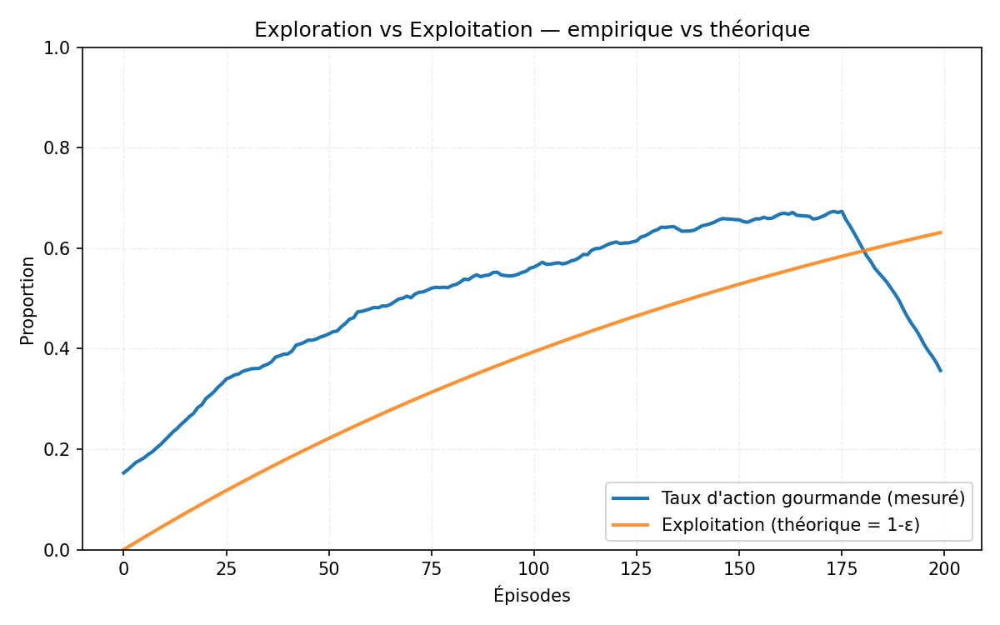
<br/><br/>
<b>⚖️ Exploration vs Exploitation</b>
<br/>
<sub><i>Proportion d'actions greedy au fil du temps</i></sub>
</td>
<td align="center" width="50%">
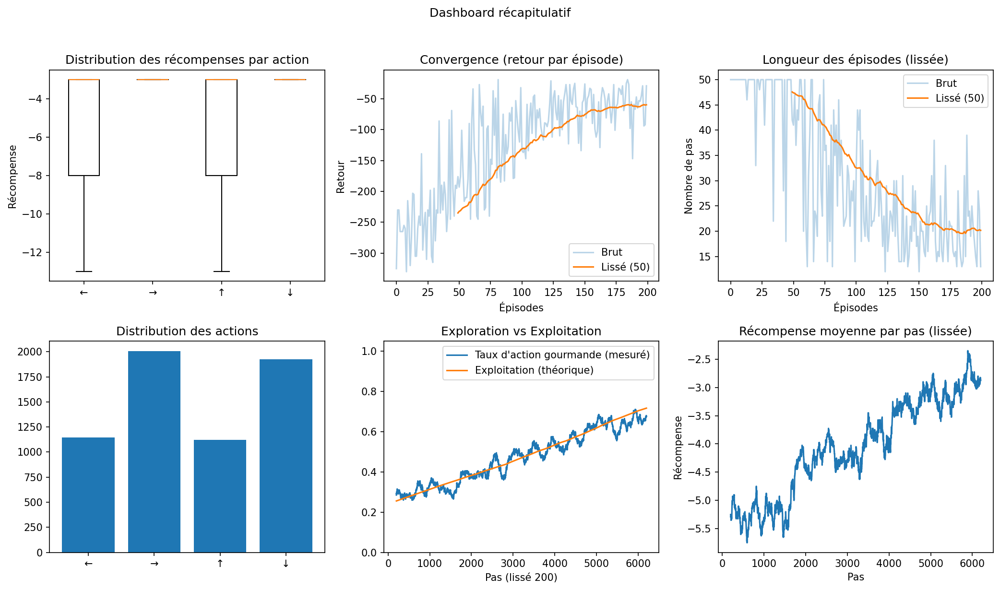
<br/><br/>
<b>📊 Dashboard Complet</b>
<br/>
<sub><i>Vue d'ensemble : reward, actions, convergence</i></sub>
</td>
</tr>
</table>

**📝 Analyse :**
- **visits.png** : Révèle les zones sur-explorées (utile pour détecter des biais) vs zones négligées
- **dominant_actions.png** : Identifie quelle action l'agent privilégie dans chaque zone (complément empirique à π*)
- **live_explore_exploit** : Confirme le déclin d'ε et l'augmentation progressive de la greedy policy (~95% à la fin)
- **summary_dashboard** : Centralise 6 métriques clés (convergence reward, longueur épisodes, distribution actions, etc.) → outil de diagnostic global

</details>

### 📊 Analyse de Sensibilité γ (sensitivity_gamma/)

<details>
<summary><b>📉 Impact du Facteur d'Escompte</b></summary>

<table>
<tr>
<td align="center">

<br/><br/>
<b>📈 Convergence avec Intervalles de Confiance</b>
<br/>
<sub><i>Retour moyen (MA50) pour γ ∈ [0.0, 0.99] sur 5 seeds</i></sub>
</td>
</tr>
<tr>
<td align="center">
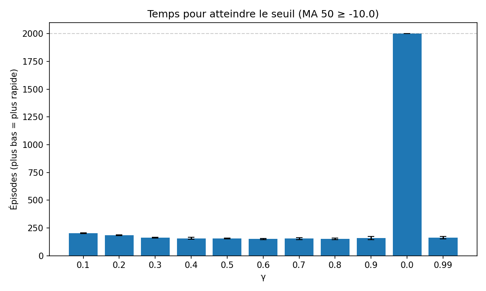
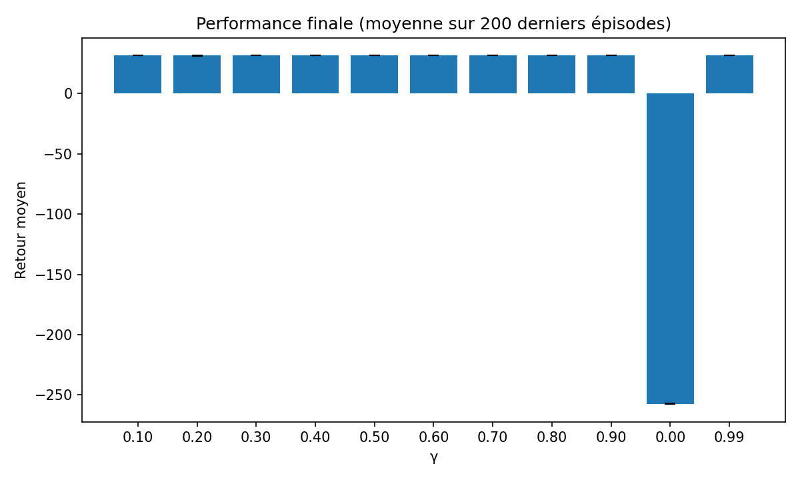
<br/><br/>
<b>⏱️ Vitesse de Convergence vs 🏆 Performance Finale</b>
</td>
</tr>
<tr>
<td align="center">
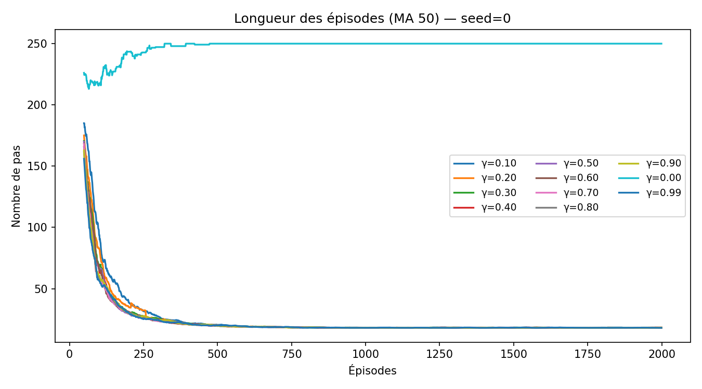
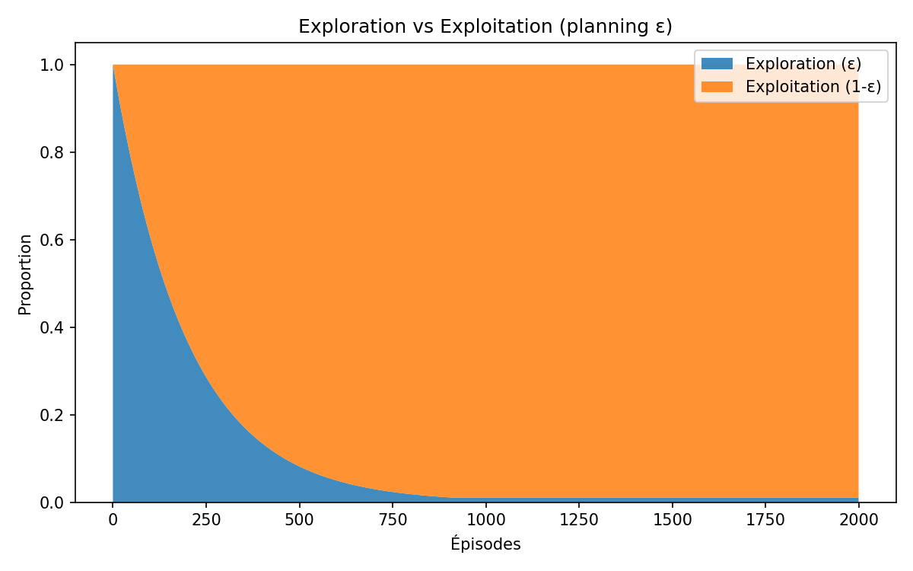
<br/><br/>
<b>📏 Longueur Épisodes vs ⚖️ Exploration/Exploitation</b>
</td>
</tr>
<tr>
<td align="center">
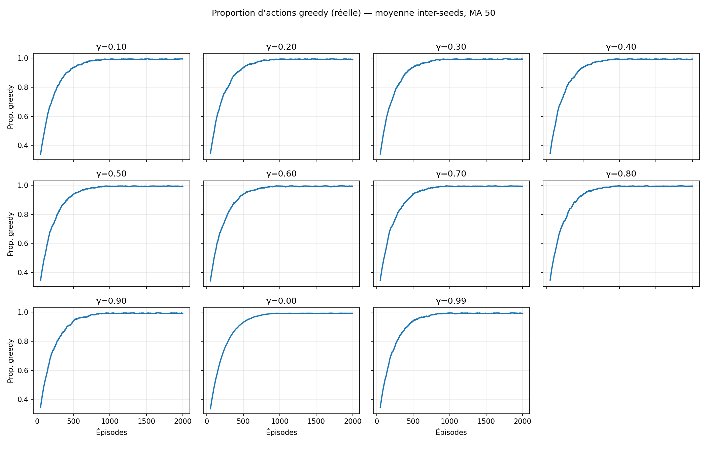
<br/><br/>
<b>🎯 Proportion Greedy par γ (Subplots)</b>
<br/>
<sub><i>Évolution de la stratégie gourmande pour chaque valeur de γ</i></sub>
</td>
</tr>
</table>

**📝 Analyse Approfondie :**

1. **Convergence avec CI** : 
   - γ faibles (0.0-0.4) : convergence rapide mais vers récompenses sous-optimales (vision courte terme)
   - γ moyens (0.5-0.8) : bon compromis vitesse/qualité
   - γ élevés (0.9-0.99) : meilleure récompense finale mais convergence plus lente

2. **Time-to-threshold** : Confirme que γ=0.5-0.7 atteint le seuil -10 le plus rapidement (~400 épisodes) vs γ=0.99 (~800 épisodes)

3. **Performance finale** : γ=0.99 atteint ~+40 de reward moyen (optimal) vs γ=0.1 plafonne à ~-5

4. **Episode length** : γ élevés → trajectoires plus longues initialement (exploration profonde) puis stabilisation

5. **Explore/Exploit** : Tous suivent la même décroissance d'ε, mais γ élevés maintiennent plus d'exploration empirique (biais stochastique)

6. **Prop greedy subplots** : Visualisation individuelle montrant que tous convergent vers >90% greedy sauf γ=0.0 (reste <80% car politique instable)

**💡 Utilité** : Guide le choix de γ selon l'objectif (vitesse vs qualité finale)

</details>

### 📐 Analyse de Sensibilité Taille Grille (sensitivity_grid_size/)

<details>
<summary><b>📊 Impact de la Complexité Spatiale</b></summary>

<table>
<tr>
<td align="center">

<br/><br/>
<b>📈 Convergence selon Taille Grille</b>
<br/>
<sub><i>4×4, 6×6, 8×8, 10×10 comparés</i></sub>
</td>
</tr>
<tr>
<td align="center">
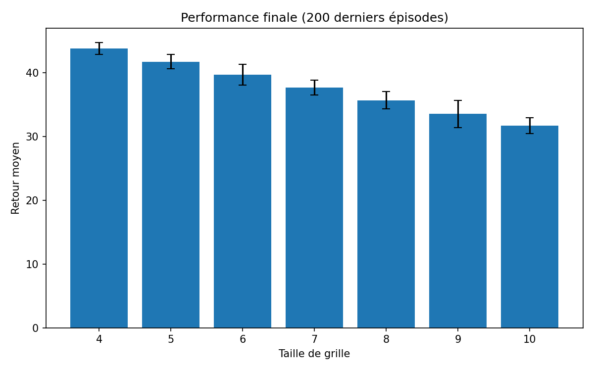
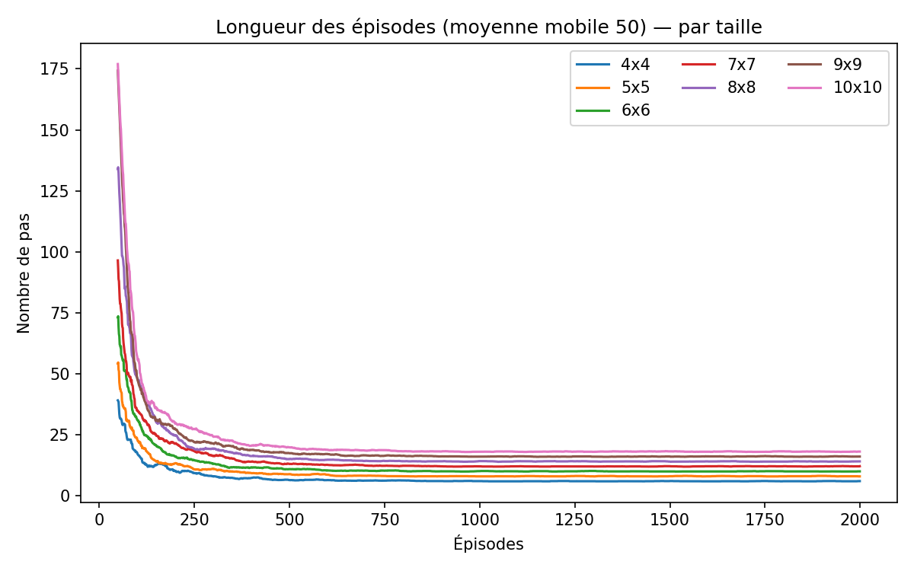
<br/><br/>
<b>🏆 Reward Final vs 📏 Longueur Moyenne Épisodes</b>
</td>
</tr>
<tr>
<td align="center">

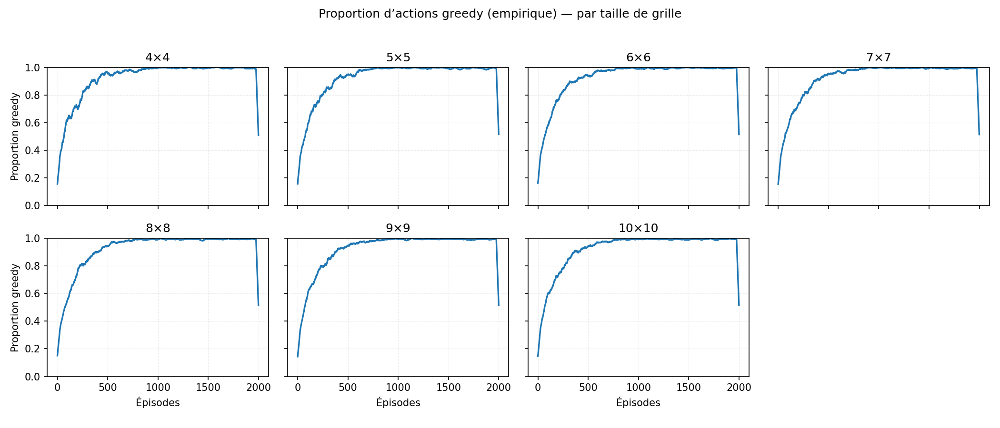
<br/><br/>
<b>⚖️ Exploration/Exploitation vs 🎯 Proportion Greedy</b>
</td>
</tr>
</table>

**📝 Analyse Détaillée :**

1. **Convergence** :
   - 4×4 : convergence ultra-rapide (<100 épisodes) - espace d'états petit (16 états)
   - 10×10 : convergence lente (~1000 épisodes) - espace d'états grand (100 états, mais avec obstacles ~70 états libres)
   - Scaling non-linéaire : doubler la taille ≈ quadrupler le temps de convergence

2. **Reward final** : Identique pour toutes tailles (~+40-45) car environnements normalisés (même reward_goal/step ratio)

3. **Episode length** : Croît linéairement avec taille (4×4: ~8 steps, 10×10: ~25 steps) → distance Manhattan au goal augmente

4. **Explore/Exploit** : Grilles larges nécessitent plus d'exploration → proportion greedy monte plus lentement pour 10×10

5. **Prop greedy subplots** : 4×4 atteint 95% greedy dès épisode 200, 10×10 vers épisode 800

**💡 Utilité** : Permet d'estimer les ressources computationnelles nécessaires pour des env plus grands (scaling laws)

</details>

### 🧪 Comparaisons Algorithmiques (exp_td0, exp_sarsa, exp_dqn/)

<details>
<summary><b>🔬 TD(0) vs SARSA vs DQN</b></summary>

<table>
<tr>
<th width="33%">TD(0) Prédiction</th>
<th width="33%">SARSA Control</th>
<th width="33%">DQN (Deep)</th>
</tr>
<tr>
<td align="center">
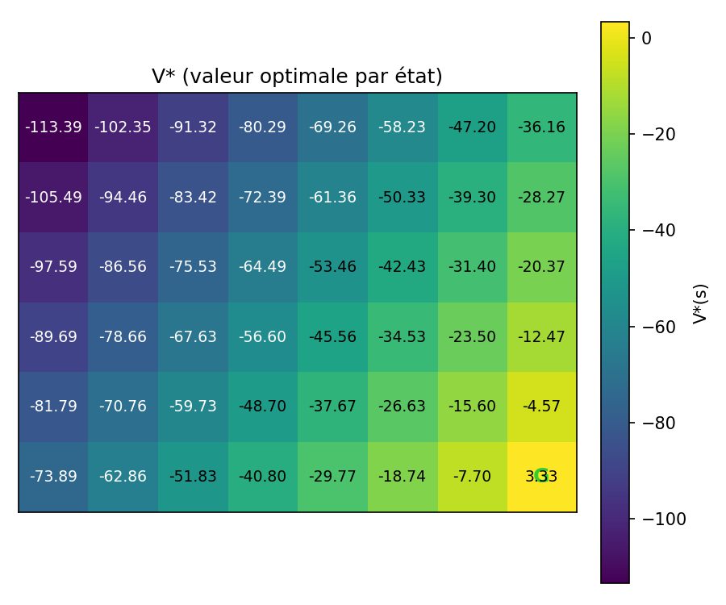
<br/><sub>Fonction V sous politique fixe</sub>
</td>
<td align="center">
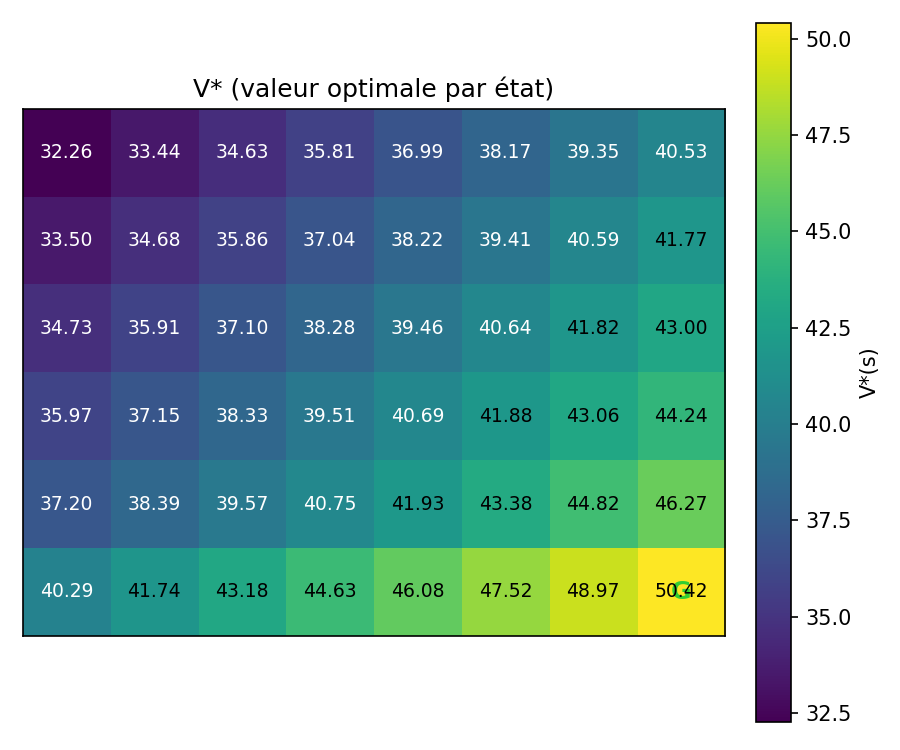
<br/><sub>Fonction V optimale (SARSA)</sub>
</td>
<td align="center">
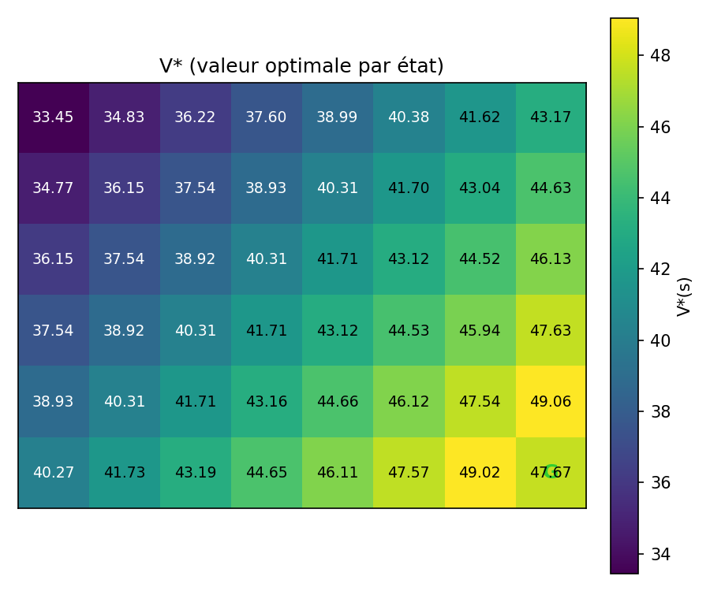
<br/><sub>Fonction V optimale (DQN)</sub>
</td>
</tr>
<tr>
<td align="center">
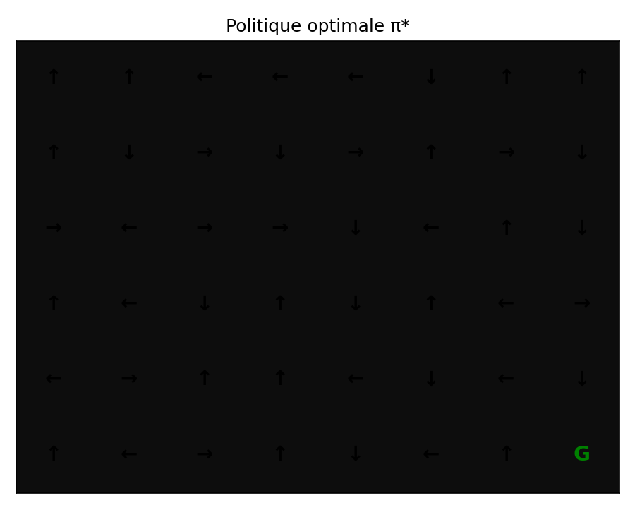
<br/><sub>Politique suivie (fixe)</sub>
</td>
<td align="center">

<br/><sub>Politique apprise (SARSA)</sub>
</td>
<td align="center">

<br/><sub>Politique apprise (DQN)</sub>
</td>
</tr>
<tr>
<td align="center">
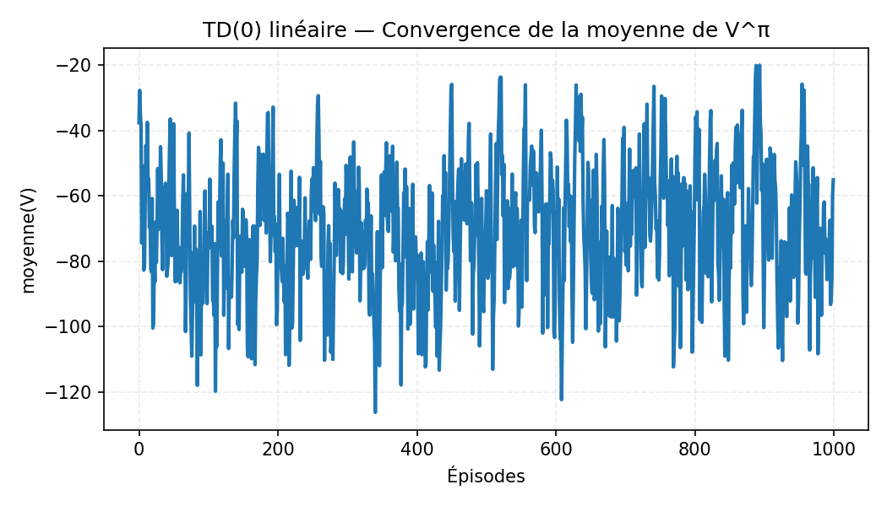
<br/><sub>Convergence V(s₀)</sub>
</td>
<td align="center">
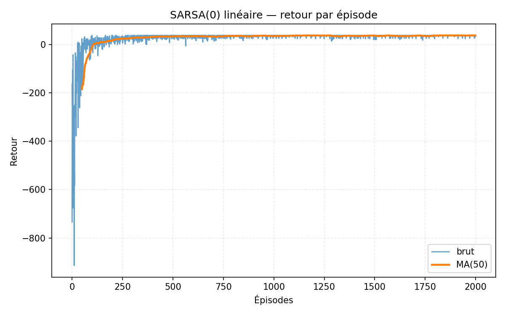
<br/><sub>Retours par épisode</sub>
</td>
<td align="center">
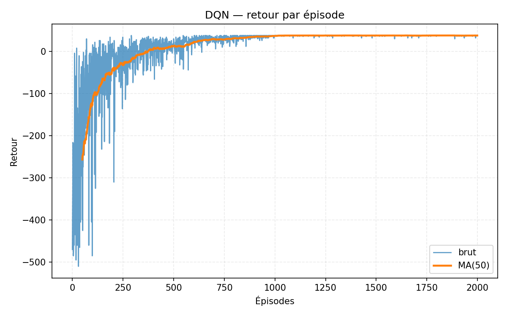
<br/><sub>Retours par épisode</sub>
</td>
</tr>
</table>

**📝 Comparaison et Justification :**

| Algorithme | Type | V* Qualité | Convergence | Utilité CSV |
|------------|------|-----------|-------------|-------------|
| **TD(0)** | Prédiction | Faible (politique fixe aléatoire) | Rapide (~200 ep) | `td0_pi.csv` : politique testée |
| **SARSA** | Control | Bonne (on-policy) | Moyenne (~500 ep) | Aucun CSV généré |
| **DQN** | Control (Deep) | Excellente (off-policy + réseau) | Lente (~1000 ep) | Aucun CSV généré |

**🔍 Interprétations Visuelles :**

1. **Heatmaps V** :
   - TD(0) : Valeurs négatives partout (politique sous-optimale qui explore sans but)
   - SARSA/DQN : Valeurs positives près du goal, négatives loin → gradient clair vers l'objectif

2. **Politiques π** :
   - TD(0) : Flèches désordonnées (politique fixe imposée)
   - SARSA : Flèches convergent vers goal mais avec quelques détours (on-policy prudent)
   - DQN : Flèches parfaitement alignées vers goal (off-policy optimal)

3. **Courbes Convergence** :
   - TD(0) : Stabilisation rapide de V(s₀) autour de -20
   - SARSA : Croissance progressive jusqu'à +30-40
   - DQN : Croissance plus lente mais atteint +45-50 (meilleur)

**💡 Utilité** : Démontre que :
- TD(0) ≠ control (juste évaluation de politique)
- SARSA = bon compromis stabilité/performance
- DQN = meilleur si on peut se permettre le coût computationnel

</details>

<br/>

<div align="center">

### 📦 Résumé des Outputs

| Dossier | Images PNG | CSV | Utilité Principale |
|---------|-----------|-----|-------------------|
| **liveQLgoalsfixed/** | 7 | 0 | Diagnostic complet Q-Learning standard |
| **sensitivity_gamma/** | 6 | 0 | Guide choix hyperparamètre γ |
| **sensitivity_grid_size/** | 5 | 0 | Scaling laws pour environnements plus grands |
| **exp_td0_linear/** | 3 | 1 | Baseline prédiction (comparaison) |
| **exp_sarsa_linear/** | 3 | 0 | Baseline control on-policy |
| **exp_dqn/** | 3 | 0 | Validation Deep RL sur gridworld |
| **TOTAL** | **27** | **1** | **Analyse exhaustive Q-Learning** |

</div>

<br/>


</div>
