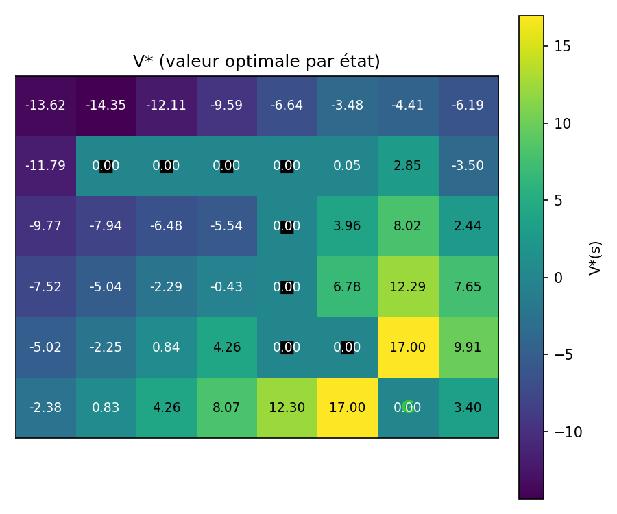
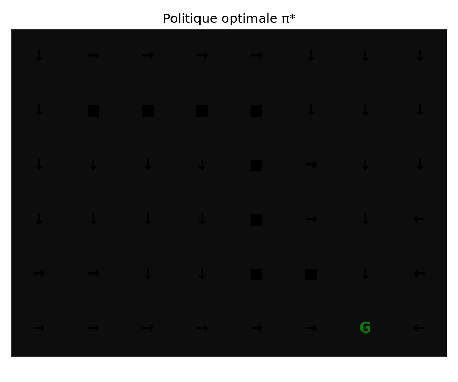
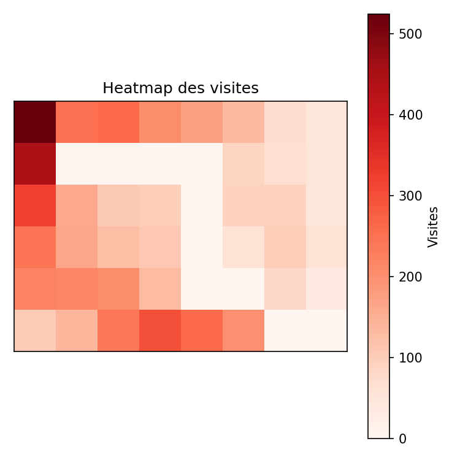
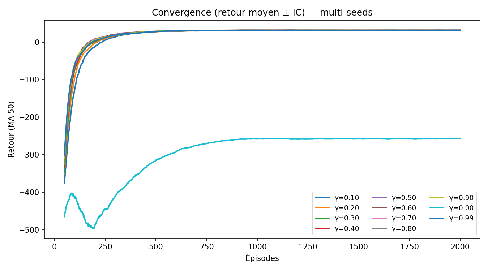
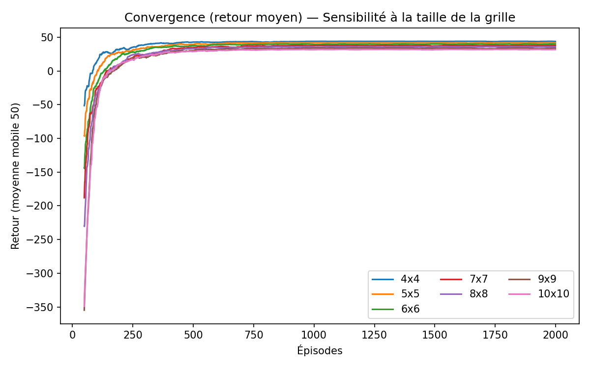

<div align="center">


<br/>


<br/>

**Environnements GridWorld configurables avec diagnostics Q-Learning complets**

</div>

<br/>


## 🎯 Aperçu

Cette session rend tous les composants du GridWorld configurables (goals, obstacles, cibles mobiles) et se concentre sur l'agent Q-Learning dont le comportement est résumé dans les graphiques sous `figures/goal`.

## 🚀 Démarrage Rapide

<details open>
<summary><b>⚙️ 1. Activer l'environnement</b></summary>

```powershell
& C:\Users\DJERI\VSCODE\Programmation\python\environnements\rl_venv\Scripts\Activate.ps1
```
</details>

<details>
<summary><b>▶️ 2. Lancer les expériences</b></summary>

```bash
cd seance2
python -m minegym.experiments.liveQL
python -m minegym.experiments.sensitivity_gammaQL
python -m minegym.experiments.sensitivity_grid_sizeQL
```
</details>

<details>
<summary><b>📊 3. Visualiser les résultats</b></summary>

Consultez les dashboards, GIFs et heatmaps dans `figures/goal` ou visualisez `live_training.mp4` pour observer la stratégie de l'agent.
</details>

## 🧪 Suite d'Expériences

<table>
<tr>
<th>📝 Script</th>
<th>🎯 Objectif</th>
<th>📄 Sortie</th>
</tr>
<tr>
<td><code>liveQL</code></td>
<td>Surveiller l'agent avec un flux Matplotlib en direct et logger les dynamiques de récompenses/ε pendant que le GridWorld s'exécute</td>
<td>
• <code>live_training.mp4</code><br/>
• Dashboards de récompenses<br/>
• Heatmaps de politique<br/>
• Visualisations dominance d'actions
</td>
</tr>
<tr>
<td><code>sensitivity_gammaQL</code></td>
<td>Comparer la vitesse de convergence, récompense finale et avidité d'exploration pour plusieurs valeurs de γ</td>
<td>
• Figures <code>sensitivity_gamma_*</code><br/>
• Graphiques avec intervalles de confiance<br/>
• Courbes de croissance<br/>
• Sous-graphiques proportion greedy
</td>
</tr>
<tr>
<td><code>sensitivity_grid_sizeQL</code></td>
<td>Comparer les mêmes statistiques quand la grille augmente de 4×4 à 10×10</td>
<td>
• Figures <code>sensitivity_grid_*</code><br/>
• Courbes de convergence<br/>
• Barres de récompense finale<br/>
• Portraits d'exploration
</td>
</tr>
</table>

## 📐 Mise à Jour Q-Learning Corrigée (paramètre w)

Au lieu de la cible TD classique, cette séance demande un terme de correction `w` qui met à l'échelle la mise à jour des valeurs d'action :

$$Q(s,a) \leftarrow Q(s,a) + \alpha \cdot w \cdot \left[r + \gamma \max_{a'} Q(s',a') - Q(s,a)\right]$$

où `w` ajuste l'agressivité avec laquelle la valeur tabulaire se déplace vers la cible TD lorsque le monde change (goals mobiles, nouveaux obstacles). Essayez des valeurs entre 0.5 et 1.2 et comparez la vitesse de stabilisation des courbes de récompense.

## 🖼️ Résumé des Sorties Visuelles

<div align="center">

<table>
<tr>
<td align="center" width="50%">

<br/><br/>
<b>Heatmap Fonction de Valeur</b>
</td>
<td align="center" width="50%">

<br/><br/>
<b>Grille Politique Optimale</b>
</td>
</tr>
<tr>
<td align="center" width="50%">

<br/><br/>
<b>Distribution Visites États</b>
</td>
<td align="center" width="50%">

<br/><br/>
<b>Actions Dominantes</b>
</td>
</tr>
</table>

### 📊 Analyse de Sensibilité

<table>
<tr>
<td align="center">

<br/><br/>
<b>Sensibilité γ : Convergence avec Intervalles de Confiance</b>
</td>
</tr>
<tr>
<td align="center">

<br/><br/>
<b>Sensibilité Taille Grille : Courbes de Convergence</b>
</td>
</tr>
</table>

</div>

---

## ⚙️ Modifier l'environnement GridEnv

Le fichier principal pour régler la logique du monde est : `minegym/envs/gridworld.py`

<br/>

<div align="center">


</div>
